# amordle Concept Gallery Map

**Updated:** 2026-07-18
**Status:** Portable locked visual authority for the greenfield amordle build.
**Publication:** Private bootstrap material; exclude from any future public application history.

## Purpose and authority

This is the durable visual authority for the greenfield amordle implementation. Read it before planning architecture, styling, responsive behavior, route composition, or implementation milestones.

It records:

- the final locked image for every accepted desktop and mobile surface;
- the binding description and correction notes that override generated-image drift;
- the relationship between product routes and concept coverage;
- the implementation rules that prevent generated fixtures or art defects from becoming product behavior.

Current user instructions, `CONSTITUTION.md`, `FUNCTIONAL-CONTRACT.md`, `BACKEND-AND-SERVICES-CONTRACT.md`, and `TESTING-AND-ACCEPTANCE-CONTRACT.md` remain higher-authority behavior sources. A generated image is a visual target, not independent authority for product rules, data, copy, privacy, or service state. The binding notes below are the portable replacement for the excluded historical selection-gate files.

## Status key

- **Locked:** Ryan selected the image. Its resolved selection gate and binding corrections are part of the lock.
- **Binding note:** A textual correction or product rule that overrides misleading, impossible, inaccessible, fabricated, or legally risky details in generated art.
- **Fixture:** Illustrative content only; production values must derive from real state and sanctioned data.

## Locked gallery index

| ID | Product surface | Viewport | Locked direction | Selection |
|---|---|---:|---|---|
| L01 | Active gameplay shell | 1440×1024 | [Thermal Divide](concepts/locked/L01.png) | Binding gate inlined below |
| L02 | Active gameplay shell | 390×844 | [Score Dock](concepts/locked/L02.png) | Binding gate inlined below |
| L03 | COMBAT hub | 1440×1024 | [Match Exchange](concepts/locked/L03.png) | Binding gate inlined below |
| L04 | COMBAT hub | 390×844 | [Exchange Sheet](concepts/locked/L04.png) | Binding gate inlined below |
| L05 | Ranked Practice COMBAT post-match | 1440×1024 | [Verdict Line](concepts/locked/L05.png) | Binding gate inlined below |
| L06 | Ranked Practice COMBAT post-match | 390×844 | [Result Sheet](concepts/locked/L06.png) | Binding gate inlined below |
| L07 | PLAY / Solo overview | 1440×1024 | [Twin Gate](concepts/locked/L07.png) | Binding gate inlined below |
| L08 | PLAY / Solo overview | 390×844 | [Stacked Gate](concepts/locked/L08.png) | Binding gate inlined below |
| L09 | Daily Calendar hub | 1440×1024 | [Today Ledger](concepts/locked/L09.png) | Binding gate inlined below |
| L10 | Daily Calendar hub | 390×844 | [Command Stack](concepts/locked/L10.png) | Binding gate inlined below |
| L11 | Unified completed-result History | 1440×1024 | [Date Rule Ledger](concepts/locked/L11.png) | Binding gate inlined below |
| L12 | Unified completed-result History | 390×844 | [Filter Sheet](concepts/locked/L12.png) | Binding gate inlined below |
| L13 | Stats and Leaderboard | 1440×1024 | [Private Signal Ledger](concepts/locked/L13.png) | Binding gate inlined below |
| L14 | Stats and Leaderboard | 390×844 | [Signal Stack](concepts/locked/L14.png) | Binding gate inlined below |
| L15 | Profile and Account | 1440×1024 | [Profile Command](concepts/locked/L15.png) | Binding gate inlined below |
| L16 | Profile and Account | 390×844 | [Profile Relay](concepts/locked/L16.png) | Binding gate inlined below |
| L17 | Marketplace and Progression | 1440×1024 | [Practice Toolkit](concepts/locked/L17.png) | Binding gate inlined below |
| L18 | Marketplace and Progression | 390×844 | [Balance Dock](concepts/locked/L18.png) | Binding gate inlined below |
| L19 | Word Explorer and Definitions | 1440×1024 | [Definition Console](concepts/locked/L19.png) | Binding gate inlined below |
| L20 | Word Explorer and Definitions | 390×844 | [Definition Stack](concepts/locked/L20.png) | Binding gate inlined below |
| L21 | Settings and Preferences | 1440×1024 | [Preference Ledger](concepts/locked/L21.png) | Binding gate inlined below |
| L22 | Settings and Preferences | 390×844 | [Category Relay](concepts/locked/L22.png) | Binding gate inlined below |
| L23 | Help, Tutorial, Feedback, and About | 1440×1024 | [Guided Briefing](concepts/locked/L23.png) | Binding gate inlined below |
| L24 | Help, Tutorial, Feedback, and About | 390×844 | [Step Stack](concepts/locked/L24.png) | Binding gate inlined below |
| L25 | Home command hub | 1440×1024 | [Local Launch](concepts/locked/L25.png) | Binding gate inlined below |
| L26 | Home command hub | 390×844 | [Gate Stack](concepts/locked/L26.png) | Binding gate inlined below |
| L27 | COMBAT Live spectator | 1440×1024 | [Live Exchange](concepts/locked/L27.png) | Binding gate inlined below |
| L28 | COMBAT Live spectator | 390×844 | [Exchange Dock](concepts/locked/L28.png) | Binding gate inlined below |
| L29 | Solo active gameplay — regular mode | 1440×1024 | [Chain Spine](concepts/locked/L29.png) | Binding gate inlined below |
| L30 | Solo active gameplay — Focus Mode | 1440×1024 | [Quiet Spine](concepts/locked/L30.png) | Binding gate inlined below |
| L31 | Solo active gameplay — regular mode | 390×844 | [Play Stack](concepts/locked/L31.png) | Binding gate inlined below |
| L32 | Solo active gameplay — Focus Mode | 390×844 | [Quiet Stack](concepts/locked/L32.png) | Binding gate inlined below |
| L33 | Solo post-game and result handoff | 1440×1024 | [Final Ledger](concepts/locked/L33.png) | Binding gate inlined below |
| L34 | Solo post-game and result handoff | 390×844 | [Verdict Stack](concepts/locked/L34.png) | Binding gate inlined below |
| L35 | COMBAT gameplay validation — eight-letter GO | 1440×1024 | [Chain Scoreline](concepts/locked/L35.png) | Binding gate inlined below |
| L36 | COMBAT gameplay validation — eight-letter GO | 390×844 | [Score Spine](concepts/locked/L36.png) | Binding gate inlined below |
| L37 | COMBAT gameplay validation — three-letter timed OG | 1440×1024 | [Time Split](concepts/locked/L37.png) | Binding gate inlined below |
| L38 | COMBAT gameplay validation — three-letter timed OG | 390×844 | [Pressure Dock](concepts/locked/L38.png) | Binding gate inlined below |
| L39 | COMBAT gameplay validation — Daily asynchronous ranked OG | 1440×1024 | [Deadline Bridge](concepts/locked/L39.png) | Binding gate inlined below |
| L40 | COMBAT gameplay validation — Daily asynchronous ranked OG | 390×844 | [Return Dock](concepts/locked/L40.png) | Binding gate inlined below |
| L41 | COMBAT gameplay validation — ranked timed Practice OG timeout result | 1440×1024 | [Clock Verdict](concepts/locked/L41.png) | Binding gate inlined below |
| L42 | COMBAT gameplay validation — ranked timed Practice OG timeout result | 390×844 | [Timeout Sheet](concepts/locked/L42.png) | Binding gate inlined below |
| L43 | COMBAT gameplay validation — ranked Practice OG post-start forfeit result | 1440×1024 | [Concession Verdict](concepts/locked/L43.png) | Binding gate inlined below |
| L44 | COMBAT gameplay validation — ranked Practice OG post-start forfeit result | 390×844 | [Verdict Dock](concepts/locked/L44.png) | Binding gate inlined below |
| L45 | COMBAT gameplay validation — ranked Practice OG pre-guess cancellation | 1440×1024 | [Cancelled Ledger](concepts/locked/L45.png) | Binding gate inlined below |
| L46 | COMBAT gameplay validation — ranked Practice OG pre-guess cancellation | 390×844 | [Cancellation Sheet](concepts/locked/L46.png) | Binding gate inlined below |
| L47 | Protected Admin — authorized refresh confirmation | 1440×1024 | [Operation Brief](concepts/locked/L47.png) | Binding gate inlined below |
| L48 | Protected Admin — authorized refresh confirmation | 390×844 | [Action Ledger](concepts/locked/L48.png) | Binding gate inlined below |
| L49 | Protected Admin — authenticated non-admin permission denied | 1440×1024 | [Lock Marker](concepts/locked/L49.png) | Binding gate inlined below |
| L50 | Protected Admin — authenticated non-admin permission denied | 390×844 | [Lock Stack](concepts/locked/L50.png) | Binding gate inlined below |
| L51 | Protected Admin — authorized refresh in flight | 1440×1024 | [Execution Ledger](concepts/locked/L51.png) | Binding gate inlined below |
| L52 | Protected Admin — authorized refresh in flight | 390×844 | [Quiet Run Dock](concepts/locked/L52.png) | Binding gate inlined below |
| L53 | Protected Admin — authorized refresh success | 1440×1024 | [Outcome Ledger](concepts/locked/L53.png) | Binding gate inlined below |
| L54 | Protected Admin — authorized refresh success | 390×844 | [Quiet Outcome Dock](concepts/locked/L54.png) | Binding gate inlined below |
| L55 | Protected Admin — authorized refresh failure | 1440×1024 | [Recovery Brief](concepts/locked/L55.png) | Binding gate inlined below |
| L56 | Protected Admin — authorized refresh failure | 390×844 | [Quiet Recovery Dock](concepts/locked/L56.png) | Binding gate inlined below |
| L57 | Protected Admin — anonymous access denied | 1440×1024 | [Guest Threshold](concepts/locked/L57.png) | Binding gate inlined below |
| L58 | Protected Admin — anonymous access denied | 390×844 | [Guest Lock Stack](concepts/locked/L58.png) | Binding gate inlined below |
| L59 | Protected Admin — unconfigured environment | 1440×1024 | [Syncless Threshold](concepts/locked/L59.png) | Binding gate inlined below |
| L60 | Protected Admin — unconfigured environment | 390×844 | [Syncless Lock Stack](concepts/locked/L60.png) | Binding gate inlined below |
| L61 | Protected Admin — authorized Operational Dashboard ready | 1440×1024 | [Operations Matrix](concepts/locked/L61.png) | Binding gate inlined below |
| L62 | Protected Admin — authorized Operational Dashboard ready | 390×844 | [Matrix Stack](concepts/locked/L62.png) | Binding gate inlined below |
| L63 | Cross-system state sheet | 1440×1024 | [Recovery Ledger](concepts/locked/L63.png) | Binding gate inlined below |
| L64 | Cross-system state sheet | 390×844 | [Continuity Dock](concepts/locked/L64.png) | Binding gate inlined below |

## Locked visual gallery and contracts

### L01–L02 — Active gameplay shell

[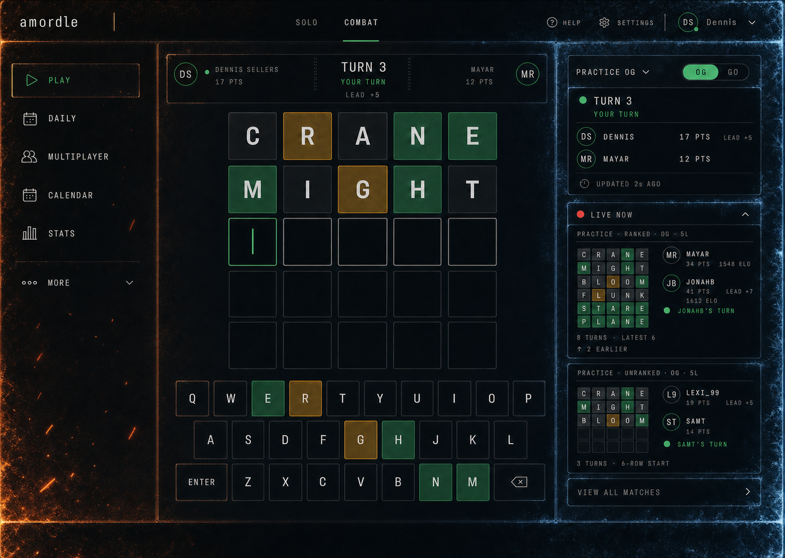](concepts/locked/L01.png)

[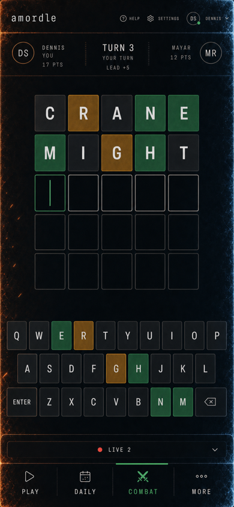](concepts/locked/L02.png)

Thermal Divide and Score Dock establish the shared active-play visual system: a calm central word board and keyboard inside a mature competitive graphite shell, balanced ember/frost perimeter atmosphere, explicit turn and score state, and restrained green interaction emphasis. `COMBAT` is the standalone multiplayer destination label.

Binding notes: replace the generated crossed-blades mobile icon with a neutral group icon or plain type; preserve compact `PRACTICE · RANKED · OG · 5L` context; do not treat weapons, franchise imagery, decorative combat motifs, or generated copy drift as accepted design language.

### L03–L04 — COMBAT hub

[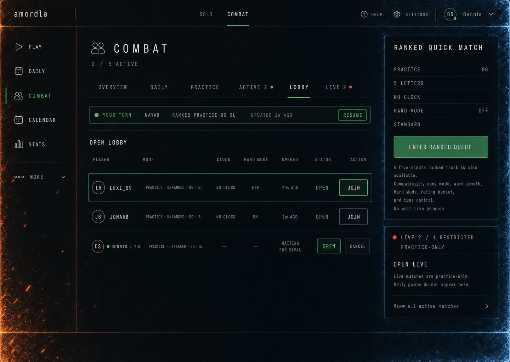](concepts/locked/L03.png)

[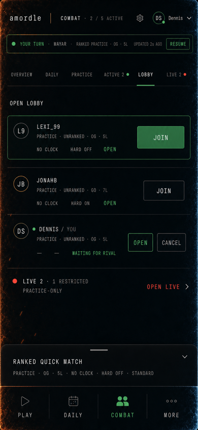](concepts/locked/L04.png)

The locked COMBAT hub is Lobby-first. It covers active-turn resume, joinable Practice lobbies, creator waiting/cancel state, ranked quick-match entry, Practice-only Live routing, and responsive disclosure without turning the destination into a generic dashboard.

Binding notes: the factual action is `OPEN LIVE`; red is reserved for the Live status dot, while the navigation action is neutral or green. Lobby, Daily, Practice, Active, and Live semantics must remain source-grounded.

### L05–L06 — Ranked Practice COMBAT post-match

[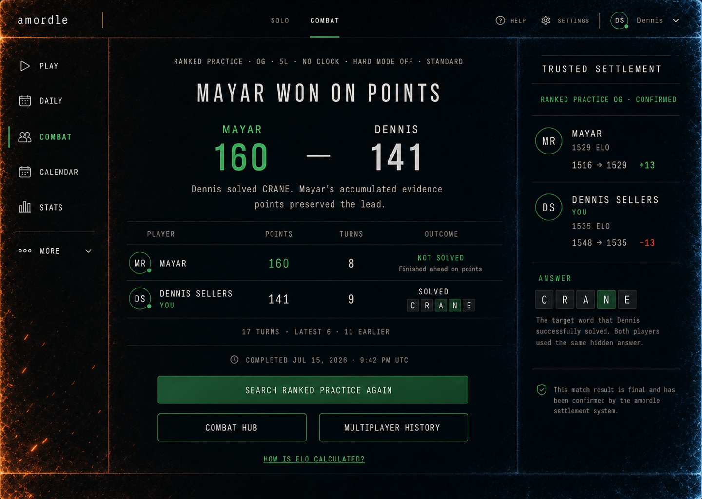](concepts/locked/L05.png)

[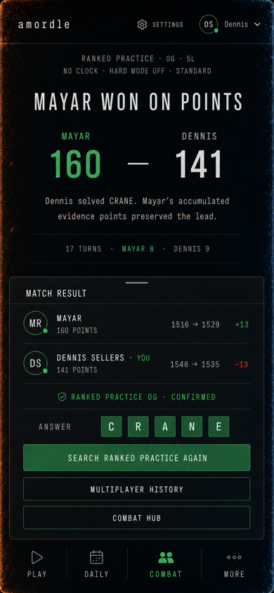](concepts/locked/L06.png)

The result pair is verdict-first: winner and 160–141 scoreline, solver-loses-on-points explanation, participant totals, confirmed Elo movement, terminal answer evidence, dominant ranked queue continuation, and subordinate History/COMBAT routes.

Binding notes: reject shield-shaped confirmation marks; use plain confirmation copy or a neutral check-circle. If `CRANE` is represented as tiles, all five are correct green. Preserve the ranked-Practice no-rematch rule and source-grounded settlement values.

### L07–L08 — PLAY / Solo overview

[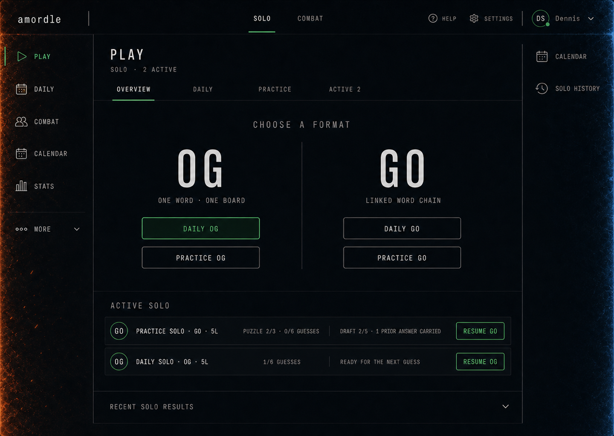](concepts/locked/L07.png)

[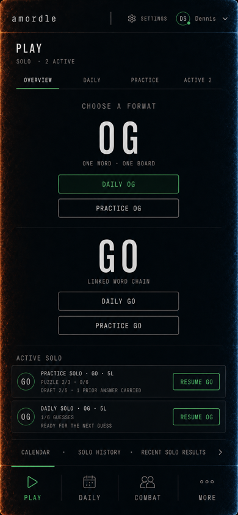](concepts/locked/L08.png)

The Solo overview preserves the two-format OG/GO mental model, four Daily/Practice starts, two exact Active Solo resume states, Calendar and Solo History access, and recent-result disclosure. `PLAY` is the destination and `SOLO` is its workspace context.

Binding notes: active answers remain private; mobile implementation must retain readable type, accessible targets, natural scrolling, and fixed-navigation clearance rather than shrinking the generated composition.

### L09–L10 — Daily Calendar hub

[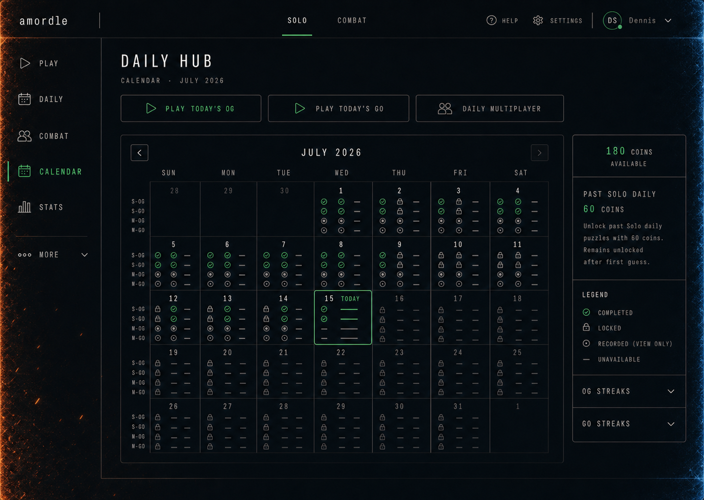](concepts/locked/L09.png)

[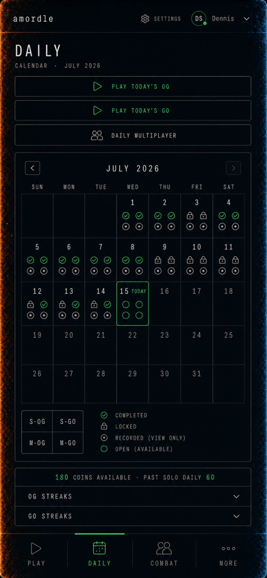](concepts/locked/L10.png)

The Daily pair makes Calendar the single hub for today's Solo OG/GO, current Daily Multiplayer, month navigation, four mode lanes per date, archive access, coin balance/rules, legend, and collapsed streak disclosures.

Binding notes: each day/mode lane has exactly one state; current Multiplayer is available on July 15; month padding is blank; only Calendar/Daily is active. Mobile archive copy is `PAST SOLO DAILY · 60 COINS`, with accessible marker labels and normal scrolling.

### L11–L12 — Unified completed-result History

[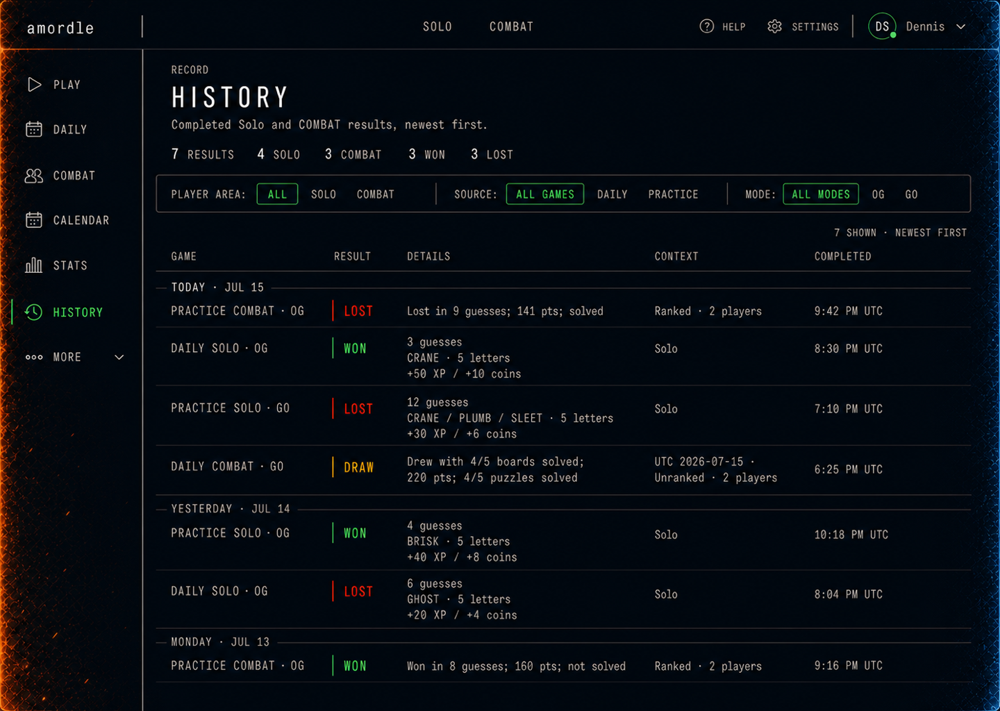](concepts/locked/L11.png)

[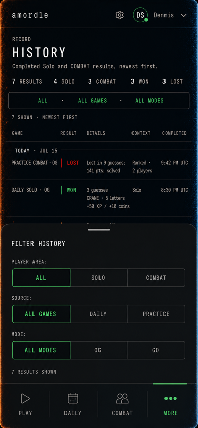](concepts/locked/L12.png)

The History pair is the shared newest-first record for completed Solo and COMBAT results. Date Rule Ledger uses a five-column desktop record with thin date rules; Filter Sheet keeps the narrow-screen record visible behind a source-literal, immediate-apply filter sheet containing Player area, Source, and Mode.

Binding notes: the mobile sheet has no Apply, Done, or Reset action; the full seven-result fixture remains available through normal scrolling when the sheet is dismissed. History has no replay, row expansion, per-guess review, search, export, profile jump, rating history, or active-game action. `MORE` is the active mobile parent.

### L13–L14 — Stats and Leaderboard

[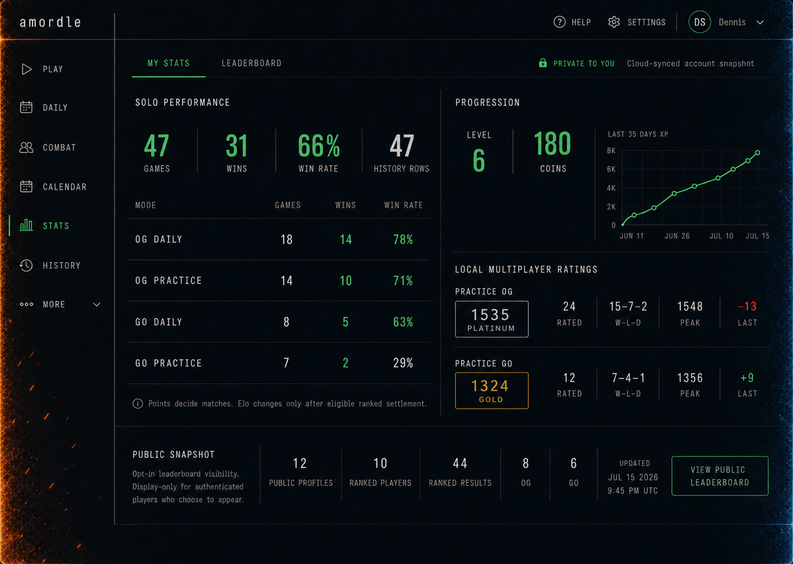](concepts/locked/L13.png)

[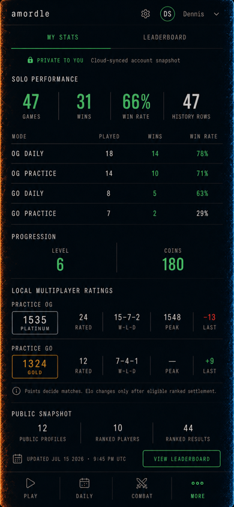](concepts/locked/L14.png)

Private Signal Ledger and Signal Stack make account-owned Solo performance, progression, and local multiplayer rating tracks the Stats hero. The authenticated public ladder remains a separate route, with only aggregate public context and a direct handoff shown on the private surface. Signal Stack preserves that authority in one naturally scrolling mobile ledger.

Binding notes: desktop generated Practice GO peak and XP plot values are illustrative and must resolve to actual stored data or disappear when unavailable. On mobile, replace the generated crossed-swords COMBAT icon with a neutral group icon or plain label and remove the unavailable Practice GO peak placeholder. Public snapshot totals do not prove service availability. Stats and Leaderboard remain independently deep-linkable and must not blend private account evidence with opt-in public-profile fields.

### L15–L16 — Profile and Account

[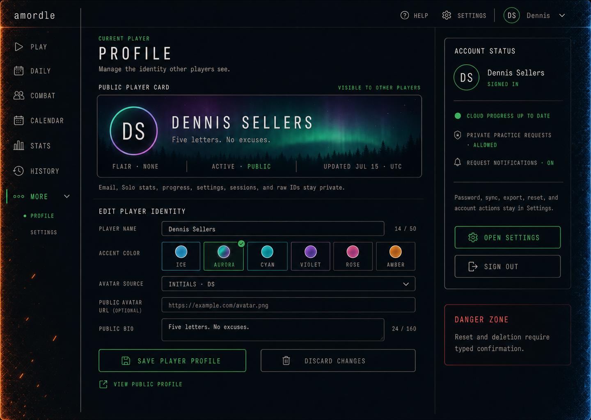](concepts/locked/L15.png)

[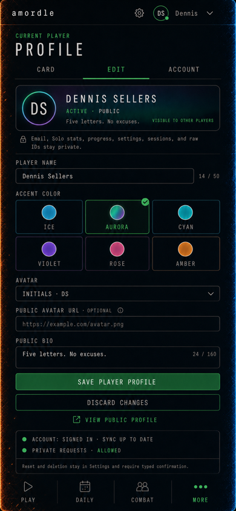](concepts/locked/L16.png)

Profile Command and Profile Relay make the sanctioned public Player card the first identity summary, then provide one disciplined editor for Player name, accent, initials/avatar source, optional public avatar URL, and bio. Private account state, request/notification preference, Settings routing, sign-out, and the Danger Zone notice remain physically separate. Profile Relay preserves the same authority through compact in-route `CARD / EDIT / ACCOUNT` disclosures rather than creating new product routes.

Binding notes: replace the generated scenic desktop banner with a nonillustrative graphite/Aurora surface and the generated trash-can discard icon with neutral text/undo treatment. Public-profile routing must use the sanctioned identifier without displaying it. The mobile example avatar URL is illustrative only. Fixture sync/request/notification/freshness labels are not service proof; private fields never enter the public preview. Mobile implementation retains readable text, accessible targets, natural scrolling, focus visibility, safe-area clearance, and fixed-navigation clearance.

### L17–L18 — Marketplace and Progression

[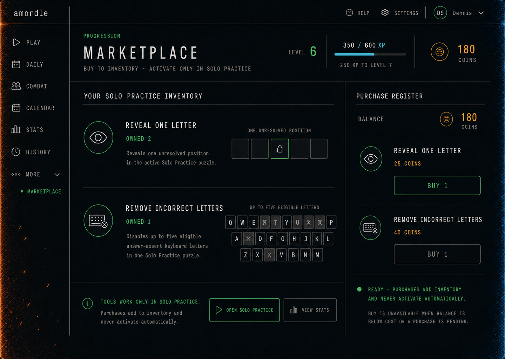](concepts/locked/L17.png)

[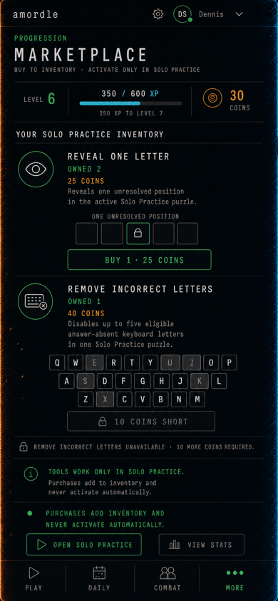](concepts/locked/L18.png)

Practice Toolkit makes owned Solo Practice inventory the Marketplace hero. It explains each tool through an answer-safe effect sample, then keeps the fixed-price purchase register secondary while preserving level/XP/coin context and direct Solo Practice/Stats handoffs. Balance Dock preserves that hierarchy on mobile while making a coherent low-balance decision explicit: 30 coins leaves Reveal One Letter buyable at 25 and disables Remove Incorrect Letters at 40 with an exact 10-coin shortfall.

Binding notes: explanatory tiles and keyboard letters never expose an active answer. Revealed positions and removed letters derive from real state, including the up-to-five eligible-letter rule. Buy availability derives from current balance/pending state with accessible text, semantics, and focus behavior. The mobile 30-coin fixture is a separate transaction-state example rather than a replacement for the desktop 180-coin fixture or service proof. The repeated inventory-only notice may be consolidated without weakening its meaning. Mobile remains naturally scrolling with readable targets and fixed-navigation/safe-area clearance. No loadout, equipment, premium currency, real-money commerce, or new route is accepted.

### L19–L20 — Word Explorer and Definitions

[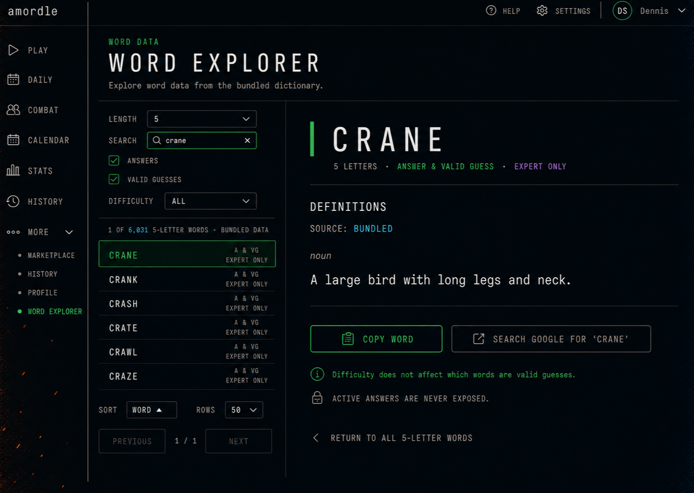](concepts/locked/L19.png)

[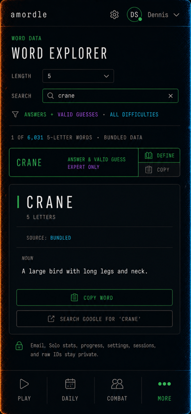](concepts/locked/L20.png)

Definition Console makes one selected word and its sourced definition the P04 desktop hero while preserving compact length/search/type/difficulty controls, word-list source context, Copy Word, external Google fallback, and active-answer privacy. Definition Stack preserves that authority in one naturally scrolling mobile search-to-definition surface.

Binding notes: search, count, and visible rows must be mutually coherent; search `crane` yields one result. Every row's type and difficulty comes from actual list data. Expert status uses text/semantics rather than purple alone. Live/bundled wording derives from real load state. Replace the mobile generated account-data sentence with the active-answer privacy rule. The selected definition is an in-route Word Explorer disclosure, not evidence that the direct Definitions placeholder route is implemented. Existing eligible terminal definition/share behavior remains binding. Mobile scrolls naturally and clears fixed navigation rather than shrinking the generated composition.

### L21–L22 — Settings and Preferences

[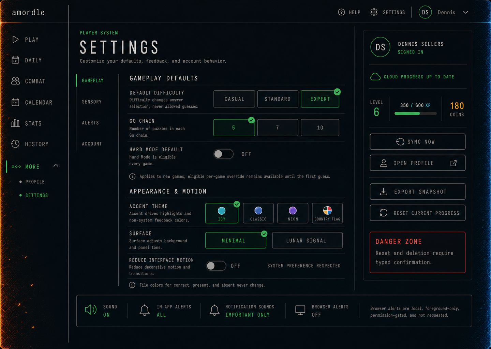](concepts/locked/L21.png)

[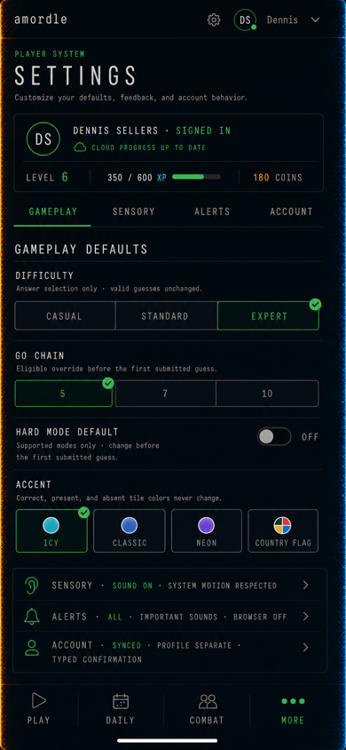](concepts/locked/L22.png)

Preference Ledger and Category Relay separate routine gameplay and appearance preferences from private account/persistence authority. The desktop uses a disciplined section index, broad settings ledger, account/sync rail, and Sound/Alerts summary; the mobile counterpart preserves this through `GAMEPLAY / SENSORY / ALERTS / ACCOUNT` in-route disclosures and stable category summaries.

Binding notes: replace the generated desktop claim that Hard Mode is eligible in every game with actual per-mode eligibility and first-submitted-guess locking. Surface selection and a manual reduced-motion control remain forward design targets requiring separate implementation authority; mobile `SYSTEM MOTION RESPECTED` is status only. Summary rows never replace the separate solo-local, multiplayer-UTC, in-app, private-request lifecycle, request-acceptance, notification-sound, browser-permission, master-sound, sync, export/reset, and typed-confirmation rules. Static Dennis, sync, progression, and permission values are fixtures rather than service proof. Profile remains separate. Accent choices require text and selection semantics rather than color alone.

### L23–L24 — Help, Tutorial, Feedback, and About

[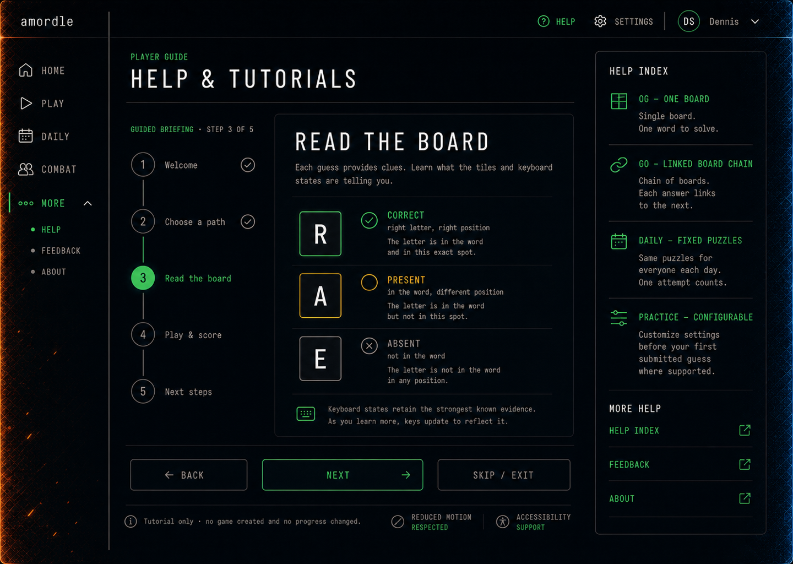](concepts/locked/L23.png)

[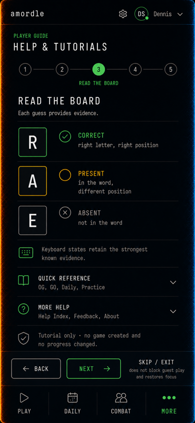](concepts/locked/L24.png)

Guided Briefing makes one nonmutating tutorial step the Help hero. Step Stack preserves the complete five-step lesson, labeled tile evidence, strongest-known keyboard note, explicit Back/Next/Skip or Exit controls, Quick Reference, More Help, and separate Help/Feedback/About handoffs in one naturally scrolling mobile hierarchy.

Binding notes: progress marks are illustrative rather than persistence proof; sample letters never represent an active answer; introductory rules do not replace About authority; Skip/Exit remains nonblocking and restores focus; Help browsing never mutates game, queue, lobby, coin, setting, or progress state. Replace the mobile shield-shaped safety icon with a neutral information circle or plain copy. Sticky tutorial actions remain above fixed navigation and never obscure scrolling content. Quick Reference and More Help remain disclosures or route handoffs rather than global tabs.

### L25–L26 — Home command hub

[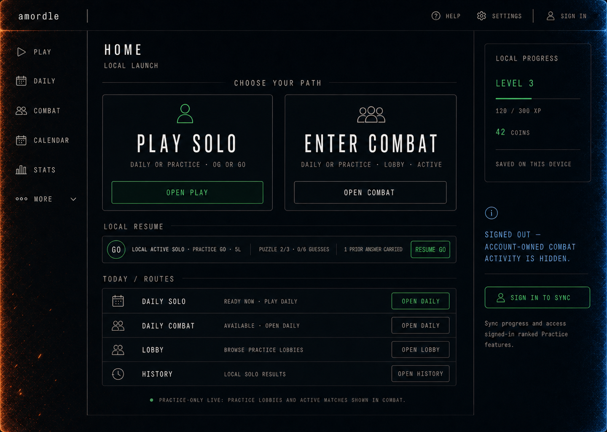](concepts/locked/L25.png)

[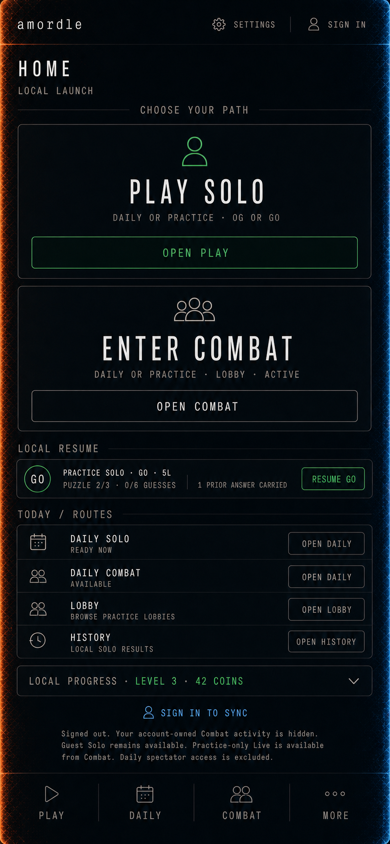](concepts/locked/L26.png)

Local Launch and Gate Stack make guest choice the Home hero: broad Solo and COMBAT routes, one exact local Solo resume, Daily and route handoffs, local progression, an explicit signed-out privacy boundary, and optional Sign In without blocking guest play. Gate Stack keeps the two complete route entrances and full Today/Routes ledger visible in a literal narrow-screen adaptation.

Binding notes: replace the generated Live sentence with `Practice-only Live is available from COMBAT; Daily spectator access is excluded.` Lobby and Live remain separate subspaces. Progression and saved-device state derive from actual guest data. Local History never surfaces stale account-owned Multiplayer results. Sign In remains optional. On mobile, use natural scrolling and readable body copy rather than shrinking the privacy/support paragraph. `Local Progress` is an accessible disclosure with a complete expanded state; sticky or fixed regions never obscure the route ledger, disclosure, or bottom navigation.

### L27–L28 — COMBAT Live spectator

[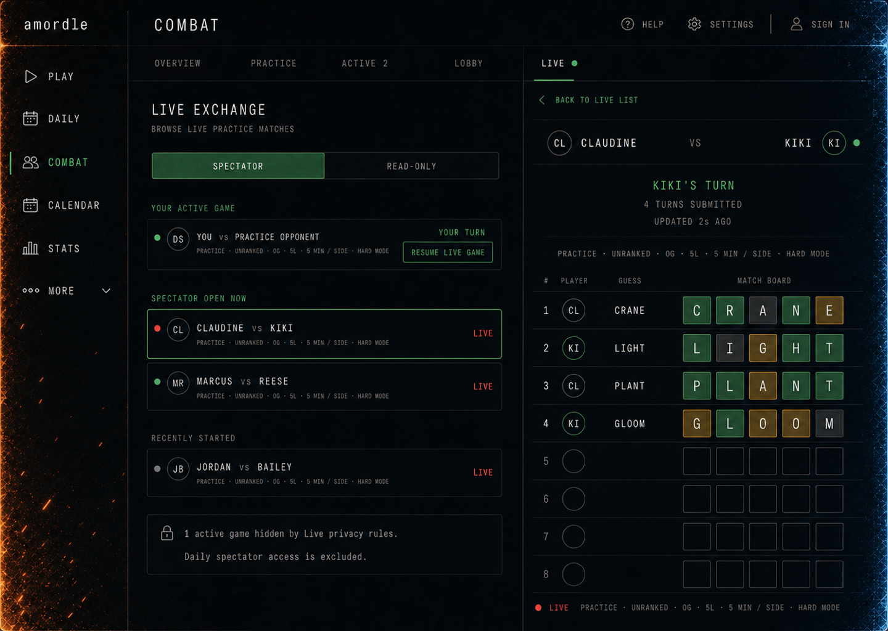](concepts/locked/L27.png)

[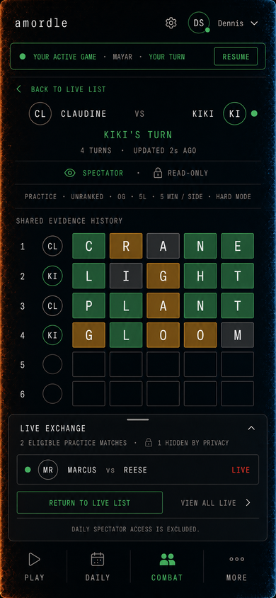](concepts/locked/L28.png)

Live Exchange and Exchange Dock preserve a browse-to-focus relationship with participant-owned resume separated from eligible Practice spectator rows, one shared chronological evidence history, sanitized identity, read-only authority, timestamp freshness, aggregate authenticated privacy, Daily exclusion, and safe focused-view return. Exchange Dock keeps fast match switching in a nonmodal in-flow disclosure above persistent navigation.

Binding notes: use an authenticated shell whenever participant resume or the hidden-game aggregate appears; capability labels are static; a four-turn playing fixture starts inside six rows; the full COMBAT subspace remains accessible; participant rows use actual safe opponent labels; no score, Elo, latency, answer, profile jump, or spectator mutation is invented. Mobile keeps one primary return plus one disclosure control, never three equivalent return actions.

### L29–L32 — Solo active gameplay regular and Focus states

[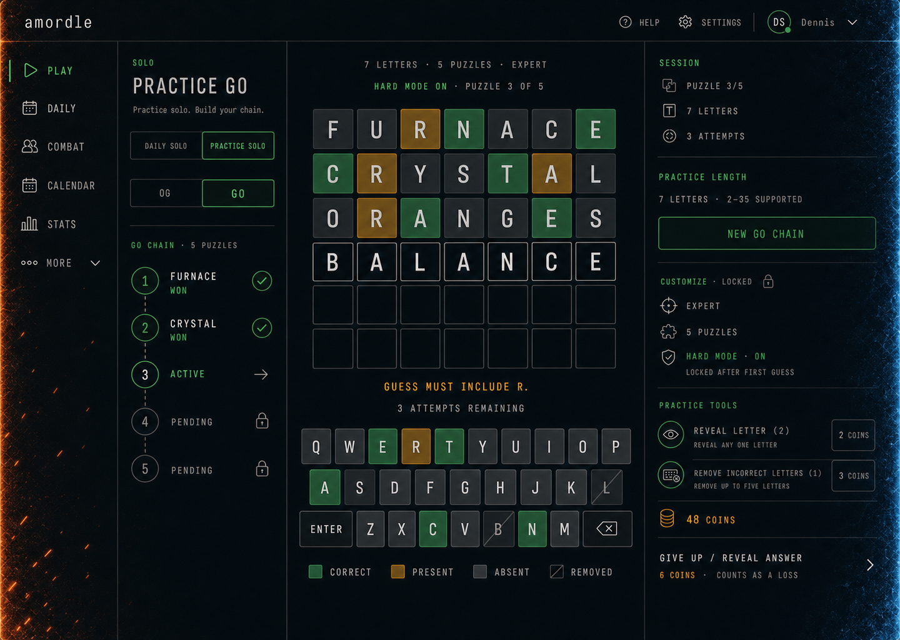](concepts/locked/L29.png)

[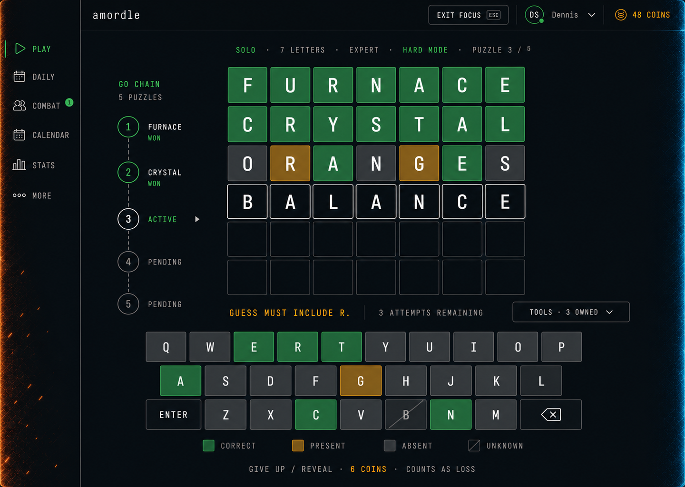](concepts/locked/L30.png)

[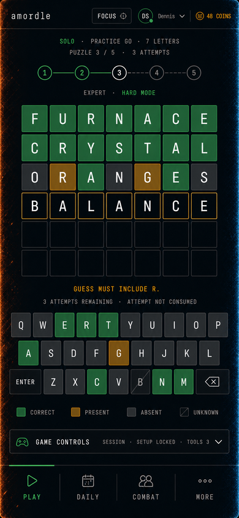](concepts/locked/L31.png)

[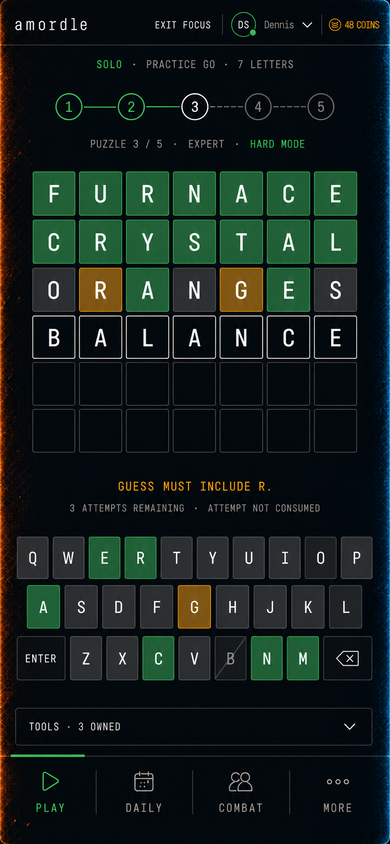](concepts/locked/L32.png)

Chain Spine is the locked regular, non-focused desktop composition. It keeps persistent destination navigation, a vertical GO-chain spine, the responsive board and complete keyboard as the central hero, and a narrow session/customization/inventory rail. Quiet Spine is its locked reversible desktop Focus Mode sibling: it reduces surrounding chrome, preserves a compact chain spine and route recovery, and keeps the exact active session dominant. Play Stack is the locked regular mobile counterpart, prioritizing uninterrupted board-and-keyboard play with a compact chain, one Game Controls disclosure, visible Focus entry, and persistent destination dock. Quiet Stack completes the family as the reduced-chrome mobile Focus state, retaining the exact board/keyboard rhythm, compact chain context, accessible Exit Focus, in-flow Tools disclosure, and visible route recovery.

Binding notes: completed prior answers use all-correct carried evidence; owned Practice tools show counts rather than activation prices; pending puzzles use neutral status; Hard Mode uses neutral settings/lock semantics; removed letters use an accessible disabled treatment. Focus context reads `SOLO · PRACTICE GO`; the slashed keyboard state means `REMOVED` or `DISABLED`; the Tools disclosure names both owned actions; and an Escape shortcut supplements but never replaces visible `Exit focus`. Play Stack's crosshair-like Focus symbol becomes plain text or neutral expand/reduce iconography, and its gamepad symbol becomes a neutral disclosure treatment. Game Controls expands in normal flow. Quiet Stack's compact `EXIT FOCUS` keeps a full accessible target; its Tools disclosure expands in flow with two Reveal Letter and one Remove Incorrect Letters inventory plus the separate six-coin loss action; route attention never relies on color alone. Focus Mode does not change routes, gameplay state, or persistence.

### L33–L34 — Solo post-game and result handoff

[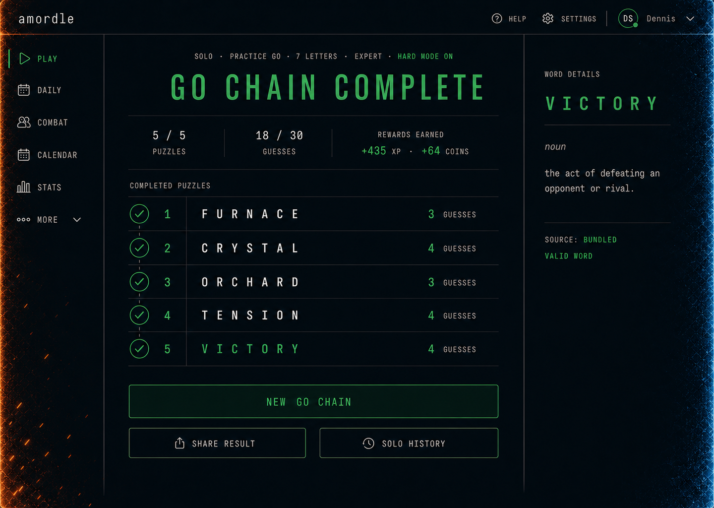](concepts/locked/L33.png)

[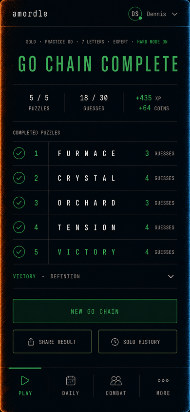](concepts/locked/L34.png)

Final Ledger and Verdict Stack form the locked completed Solo result pair. They turn a won seven-letter, five-puzzle Practice GO chain into an explicit verdict, exact aggregate attempts and deterministic rewards, a five-row answer ledger, selected post-game definition access, a dominant new-chain continuation, and subordinate Share/History routes without leaving an inactive board or keyboard as the hero. Verdict Stack preserves that hierarchy in one compact, naturally scrolling mobile ledger.

Binding notes: definition source and valid-word metadata are runtime-derived; every solved definition remains reachable; the won verdict has text/programmatic authority in addition to green emphasis; `NEW GO CHAIN` advances the Practice seed rather than replaying the completed chain; reward, completion, and history data come from the recorded session. Mobile `VICTORY · DEFINITION` expands in normal document flow, the compact ledger retains readable type and accessible completion semantics, and any fixed dock preserves safe-area/content clearance.

### L35–L36 — COMBAT gameplay validation, eight-letter GO

[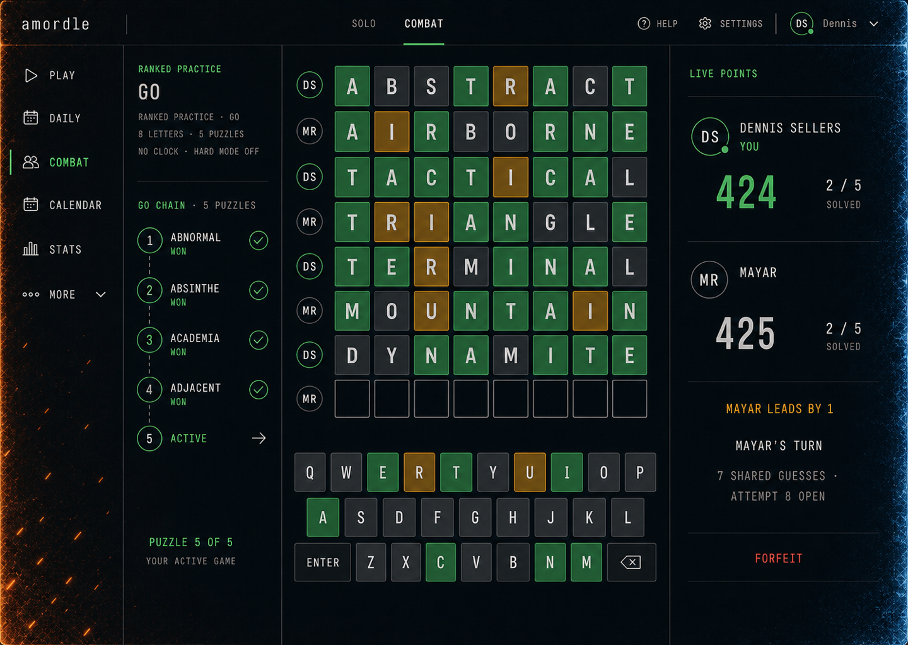](concepts/locked/L35.png)

[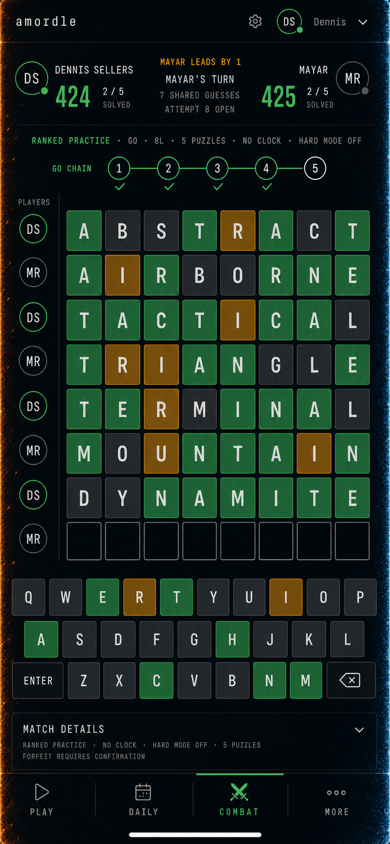](concepts/locked/L36.png)

Chain Scoreline and Score Spine are the locked desktop/mobile stress pair for an authenticated ranked Practice COMBAT GO match with eight-letter words. They preserve one shared actor-attributed board, four solved chain answers plus puzzle 5 active, seven shared guesses and an open eighth attempt, a complete keyboard, live 424–425 points, both players at 2/5 solved, MAYAR leading by one, and MAYAR to move. Score Spine keeps that authority in one naturally scrolling mobile play stack without horizontal overflow.

Binding notes: correct the desktop `PUIZZLE` typo to `PUZZLE`; replace Score Spine's generated crossed-weapons icon with a neutral group icon or plain label; keep the four prior answers reachable in an in-flow mobile GO Chain disclosure; DS/MR actor attribution follows the real alternating move history; tile, keyboard, point, and turn states are runtime-derived; live points are not Elo or final settlement; final-puzzle continuation remains open-ended after the initial attempt budget; and Forfeit stays subordinate and confirmation-gated.

### L37–L38 — COMBAT gameplay validation, three-letter timed Practice OG

[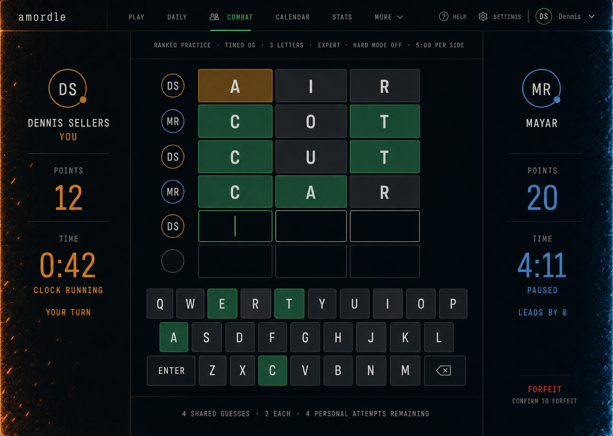](concepts/locked/L37.png)

[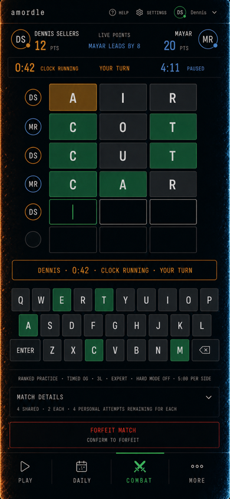](concepts/locked/L38.png)

Time Split and Pressure Dock form the locked desktop/mobile stress pair for an active authenticated ranked Practice COMBAT OG match with three-letter words and the canonical five-minute-per-side control. Both make the deliberately large narrow board and complete keyboard the calm center of the state: Dennis has 12 live projected points, `0:42` running, and the current turn; MAYAR has 20, `4:11` paused, and an eight-point lead. Pressure Dock translates the desktop participant rails into a board-first mobile flow with one in-flow low-time dock.

Binding notes: replace Pressure Dock's generated crossed-weapons COMBAT icon with a neutral group icon or plain label; label point totals as live/projected rather than Elo or settlement; preserve text/structure for clock run/pause, lead, and turn instead of relying on ember/frost color; keep actor attribution on the single shared board; express four personal attempts remaining for **each** player rather than a shared pool; keep the low-time dock in normal flow and reduced-motion safe; and keep Forfeit subordinate behind a distinct confirmation interaction.

### L39–L40 — COMBAT gameplay validation, Daily asynchronous ranked OG

[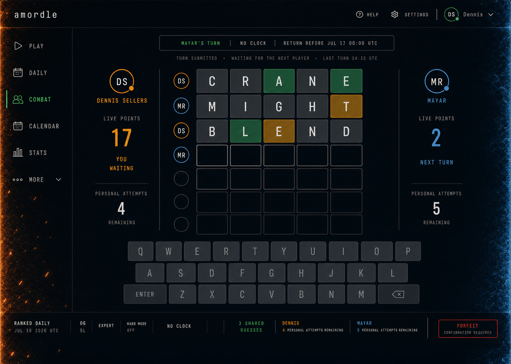](concepts/locked/L39.png)

[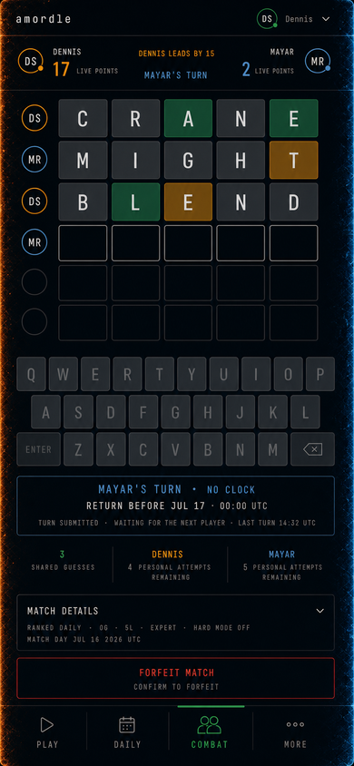](concepts/locked/L40.png)

Deadline Bridge and Return Dock form the locked desktop/mobile pair for an active authenticated ranked Daily COMBAT OG match. The desktop's thin UTC return bridge and balanced participant rails become a board-first mobile flow with one calm in-flow return dock. Both make the asynchronous contract explicit around one shared actor-attributed board: Dennis has 17 live projected points and waits after submitting at `14:32 UTC`; MAYAR has 2 points and the next turn; Dennis leads by 15; the match is clock-free and expires at the next UTC midnight.

Binding notes: production renders exactly six initial rows despite the desktop image's generated excess neutral row; the complete keyboard is visibly and programmatically disabled for Dennis; `YOU · WAITING`, `NEXT TURN`, `DENNIS LEADS BY 15`, `NO CLOCK`, and the deadline retain text/programmatic authority; ember/frost remain atmospheric only; per-player attempts never become a shared `3/6` pool; the mobile return dock stays in normal flow with full accessible participant/live-point labels and safe navigation clearance; and Forfeit stays subordinate behind a distinct confirmation interaction.

Grounding and round records remain linked from the resolved mobile selection gate.

### L41–L42 — COMBAT gameplay validation, ranked timed Practice OG timeout result

[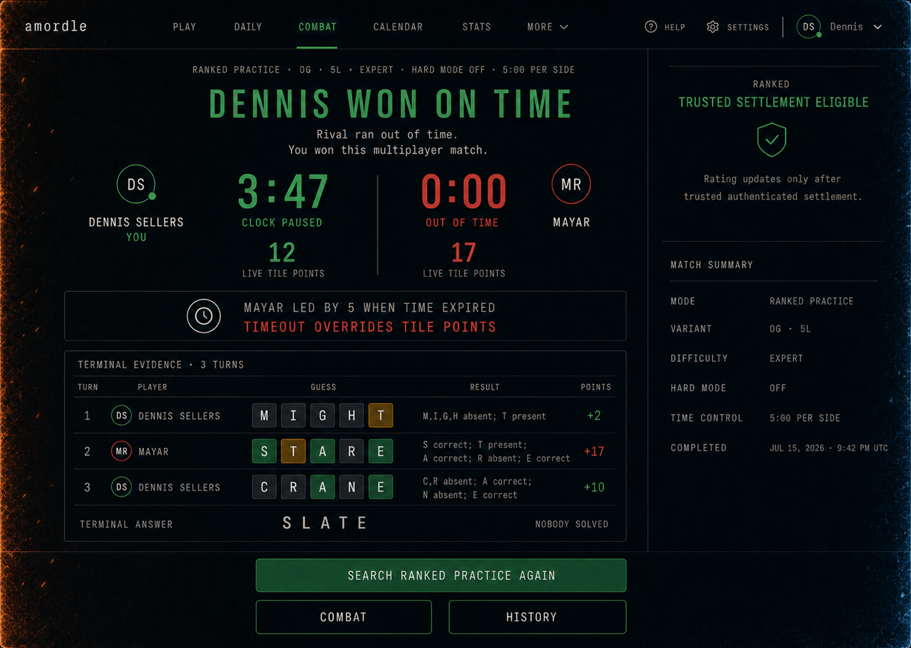](concepts/locked/L41.png)

[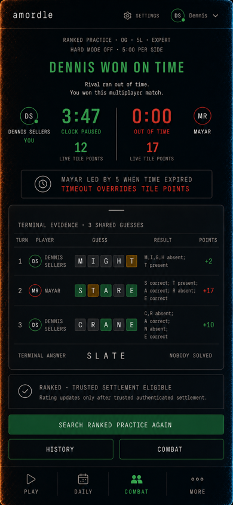](concepts/locked/L42.png)

Clock Verdict and Timeout Sheet form the locked desktop/mobile timeout-result pair for an authenticated ranked timed Practice OG match. They carry Time Split's participant clocks into Verdict Line and Result Sheet terminal hierarchies: Dennis wins with `3:47 · CLOCK PAUSED` and 12 live tile points because MAYAR reaches `0:00 · OUT OF TIME`, even though MAYAR leads 17–12. The exact shared evidence remains DS `MIGHT` +2, MR `STARE` +17, DS `CRANE` +10; nobody solved; terminal answer is `SLATE`.

Binding notes: correct generated `TITLE POINTS` to `TILE POINTS`; replace the settlement shield with plain confirmation or a neutral check-circle; derive completion time at runtime; keep timeout precedence, clocks, points, actor attribution, outcome, and nobody-solved state text-backed; preserve trusted-settlement caution without inventing rating movement; retain `SEARCH RANKED PRACTICE AGAIN` without a direct ranked rematch; keep Timeout Sheet in normal document flow; and implement its sheet as an accessible disclosure or replace the inert drag handle with a neutral divider while preserving natural scrolling and fixed-navigation clearance.

Grounding and round records remain linked from the resolved desktop and mobile selection gates.

### L43–L44 — COMBAT gameplay validation, ranked Practice OG post-start forfeit result

[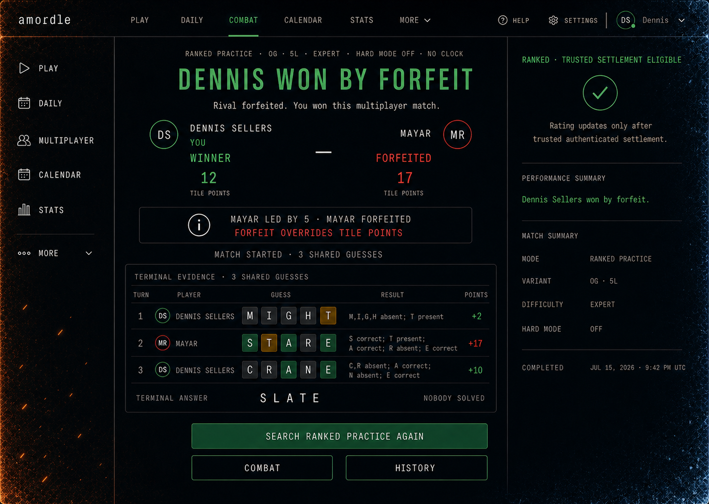](concepts/locked/L43.png)

[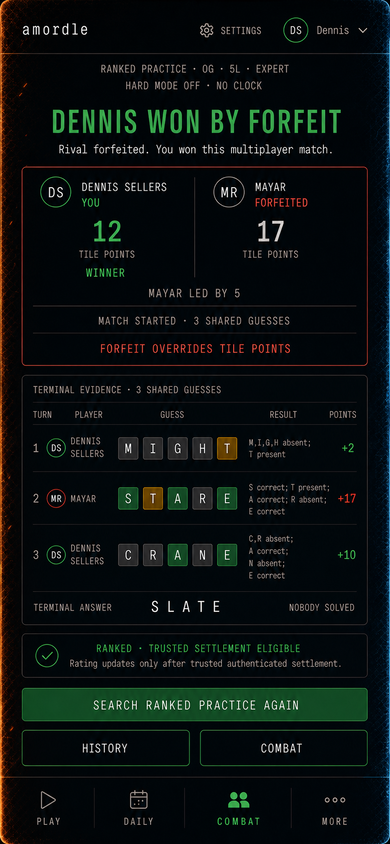](concepts/locked/L44.png)

Concession Verdict and Verdict Dock are the corrected locked desktop/mobile pair for an authenticated ranked Practice COMBAT OG match that ends after MAYAR forfeits once play has begun. MAYAR leads 17–12 on tile points, but the winner-first hierarchy and explicit `MAYAR LED BY 5 · MAYAR FORFEITED` / `FORFEIT OVERRIDES TILE POINTS` explanation make the implemented precedence clear and Dennis wins. The shared terminal evidence is DS `MIGHT` +2, MR `STARE` +17, and DS `CRANE` +10; nobody solved; terminal answer is `SLATE`.

Binding notes: replace the generated legacy desktop left-rail `MULTIPLAYER` label with standalone `COMBAT` or remove it; derive completion time at runtime; keep the information-circle neutral; keep the mobile rule dock in normal document flow; preserve full `MAYAR · FORFEITED` text; keep rose-red text-backed and reduced-motion safe; preserve trusted-settlement caution without invented rating movement; and retain `SEARCH RANKED PRACTICE AGAIN` without a direct ranked rematch.

Correction provenance: the mobile round was generated while the mistaken desktop Option 3 record was temporarily active. Ryan corrected the desktop selection to Option 1 and independently selected mobile Option 3. The accepted pair is Concession Verdict plus Verdict Dock; historical prompt records remain truthful about generation-time references.

Grounding and round records remain linked from the resolved desktop and mobile selection gates.

### L45–L46 — COMBAT gameplay validation, ranked Practice OG pre-guess cancellation

[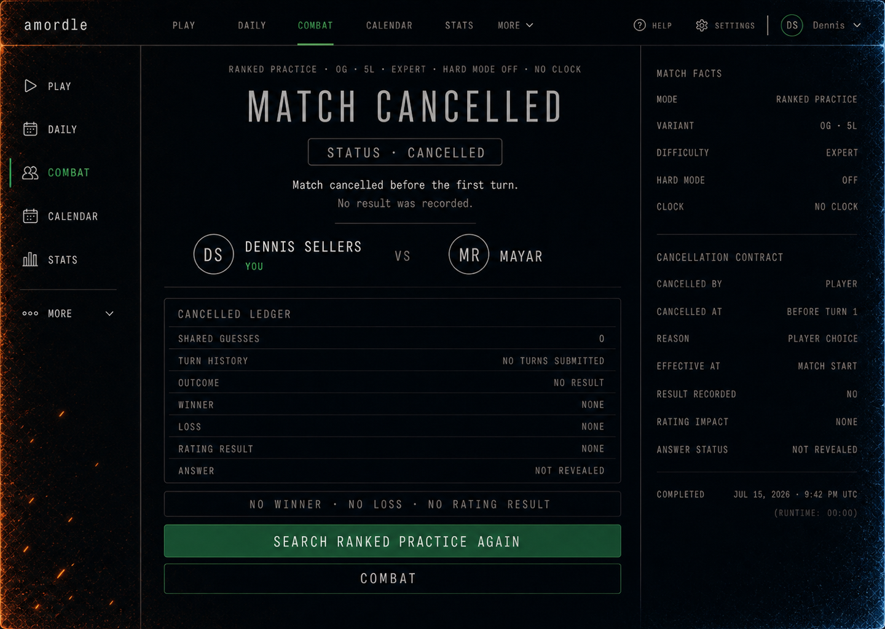](concepts/locked/L45.png)

[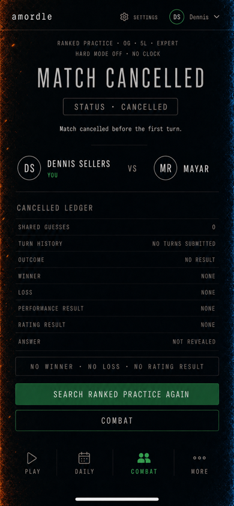](concepts/locked/L46.png)

Cancelled Ledger and Cancellation Sheet are the locked desktop/mobile pair for an authenticated ranked Practice COMBAT OG match that is cancelled after both participants join but before the first submitted turn. They present zero shared guesses, no turn history, no result, no winner/loss, no performance or rating result, and no answer reveal in an audit-friendly neutral record with ranked-search continuation.

Binding notes: remove generated `CANCELLED BY`, reason, and effective-at fields because the domain stores no forfeiting participant or reason in this zero-move branch; replace them with source-backed `SHARED GUESSES · 0`, `WINNER · NONE`, `PERFORMANCE RESULT · NONE`, and `ANSWER · NOT REVEALED`; derive timestamp/runtime from actual state; keep green `YOU` as viewer identity only; and implement the mobile ledger in normal flow with natural vertical scrolling, readable type, accessible touch targets, and safe fixed-navigation clearance.

Grounding and round records remain linked from the resolved desktop and mobile selection gates.

### L47–L48 — Protected Admin, authorized refresh confirmation

[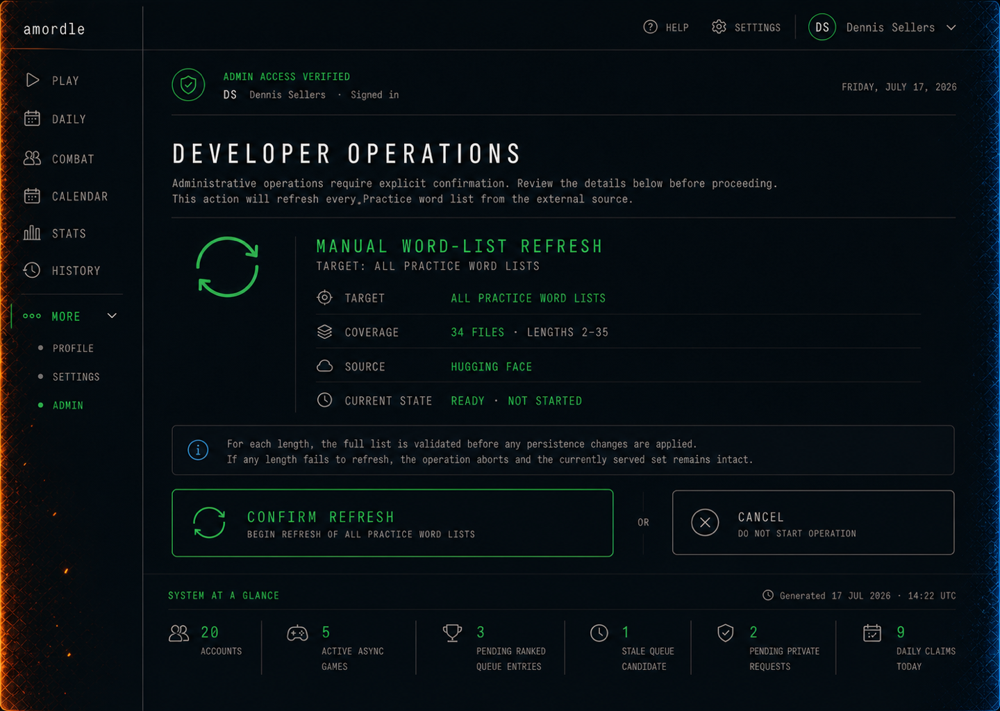](concepts/locked/L47.png)

[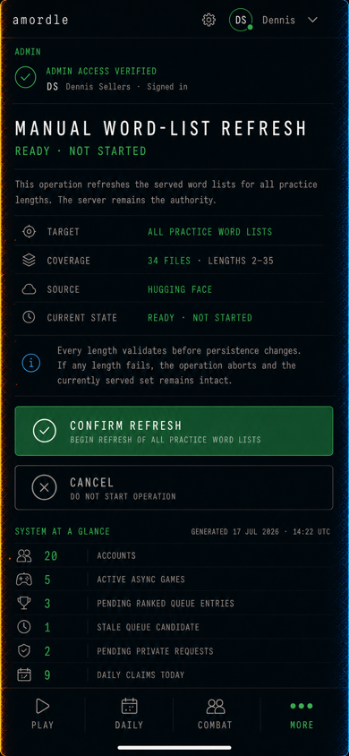](concepts/locked/L48.png)

Operation Brief and Action Ledger are the locked desktop/mobile pair for a signed-in verified Admin reviewing the full 34-file, lengths-2-through-35 Practice word-list refresh before execution. Their editorial preflight and compact operation-ledger hierarchy keep the exact target, source, ready-not-started state, all-or-nothing validation rule, confirmation pair, and privacy-safe aggregate status visible without turning the route into a generic dashboard.

Binding notes: replace generated shield/trophy-like access, queue, and request icons with neutral lock/information/check-circle, queue/list/hourglass, and request/inbox treatment; keep refresh treatment reduced-motion safe; preserve readable explanatory text, keyboard-visible confirmation, natural mobile scrolling, accessible target sizes, responsive title wrapping, and safe fixed-navigation clearance; treat account presence as account context only; derive all values at runtime; and never expose personal, raw operational, session, credential, answer, seed, service-driver, or secret data.

Grounding and round records remain linked from the resolved desktop and mobile selection gates.

### L49–L50 — Protected Admin, authenticated non-admin permission denied

[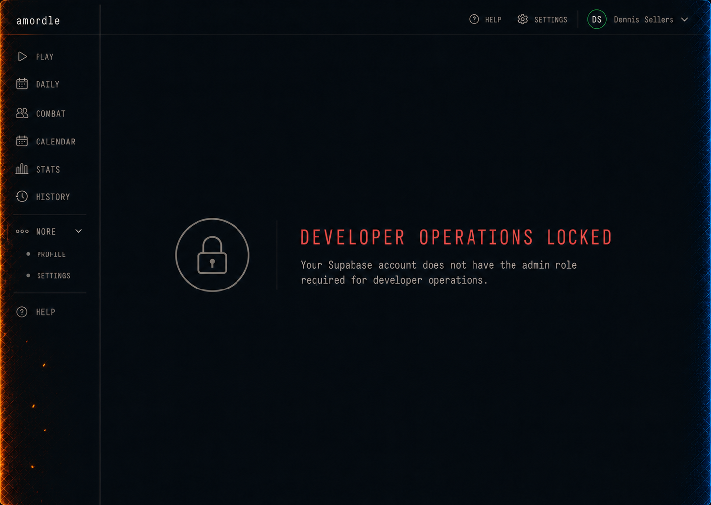](concepts/locked/L49.png)

[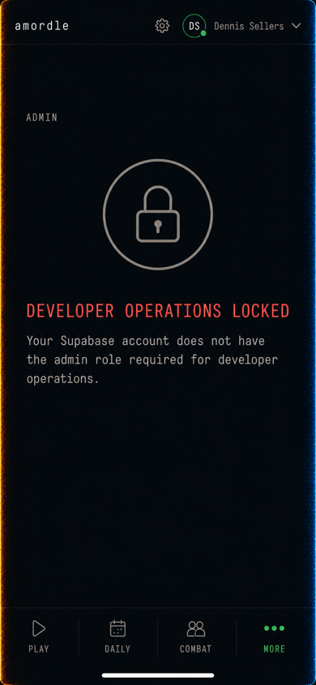](concepts/locked/L50.png)

Lock Marker and Lock Stack are the locked desktop/mobile pair for DS / Dennis Sellers signed in without the `admin` role after direct or persisted navigation reaches protected Admin. They treat the route as a quiet terminus: a neutral lock marker, the exact source denial title and reason, generous negative space, no action, no privileged-content preview, and ordinary navigation as the only exit.

Binding notes: keep `ADMIN` as the visible or accessible route heading while Admin remains absent from primary navigation; preserve the exact sentence-case source title/message in accessible text; keep the title responsive under localization and text scaling; retain accessible body size, natural mobile flow, and fixed-navigation clearance; keep the lock neutral and rose-red factual; and treat green account presence as signed-in context only, never authorization. Do not split the denial into cards or add recovery behavior.

Grounding and round records remain linked from the resolved desktop and mobile selection gates.

### L51–L52 — Protected Admin, authorized refresh in flight

[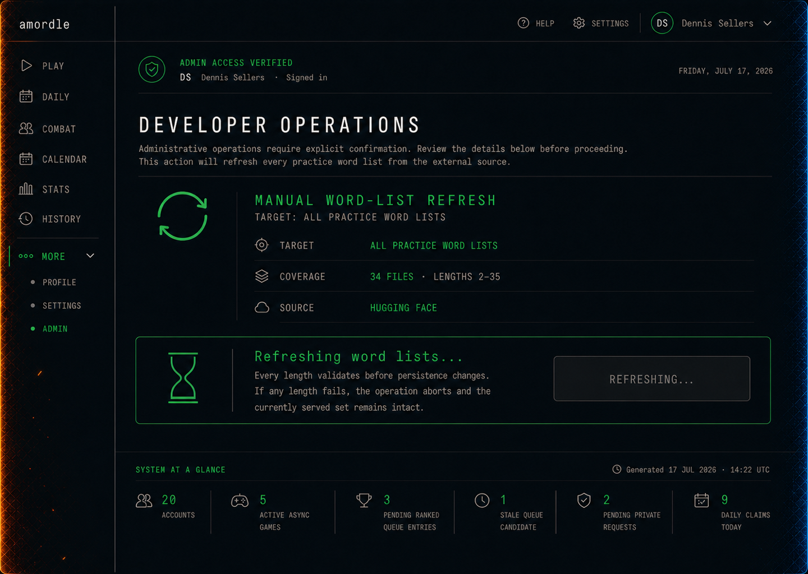](concepts/locked/L51.png)

[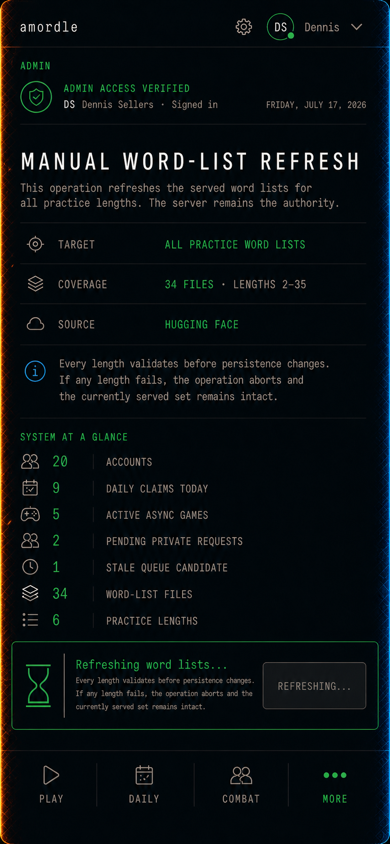](concepts/locked/L52.png)

Execution Ledger and Quiet Run Dock are the locked desktop/mobile in-flight pair for a verified Admin after confirming one full 34-file, lengths-2-through-35 Hugging Face refresh. Their ruled target ledger and calm in-flow request state keep exact live status, a disabled action, and the all-or-nothing validation rule visible without suggesting progress that the client does not receive.

Binding notes: replace stale pre-confirmation wording with truthful in-flight context; replace shield/trophy-like access and queue icons with neutral treatment; remove Quiet Run Dock's fabricated `34 WORD-LIST FILES` and `6 PRACTICE LENGTHS` operational-dashboard rows; keep the mobile dock in normal flow, nonsticky, nonmodal, and nondraggable; keep green active-not-successful; preserve exact `Refreshing word lists…` and disabled `REFRESHING…` copy; derive remaining values at runtime; and never add cancellation, percentage, determinate progress, stage, ETA, logs, partial results, or terminal outcomes.

Grounding and round records remain linked from the resolved desktop and mobile selection gates.

### L53–L54 — Protected Admin, authorized refresh success

[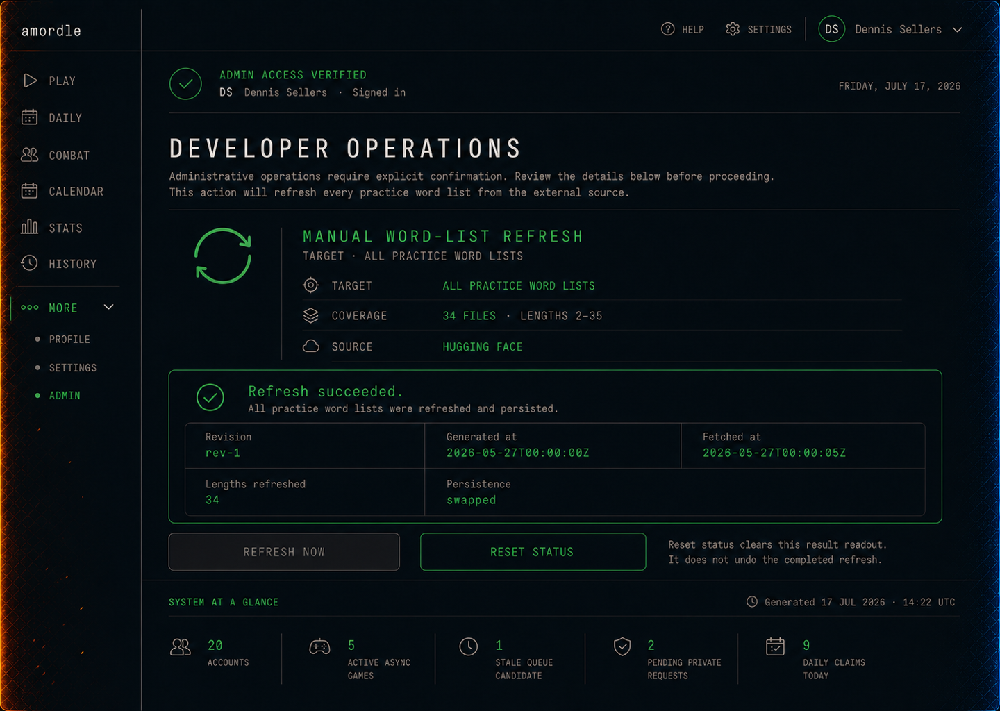](concepts/locked/L53.png)

[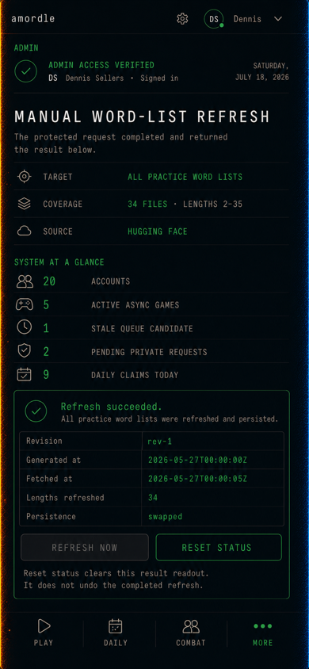](concepts/locked/L54.png)

Outcome Ledger and Quiet Outcome Dock form the locked desktop/mobile terminal-success pair for a verified Admin after one full 34-file, lengths-2-through-35 Hugging Face refresh. Both preserve the target/coverage/source record and privacy-safe operational context while replacing the in-flight band with exact `Refresh succeeded.` copy, the five bounded response fields, disabled Refresh now, and enabled non-rollback Reset status. Quiet Outcome Dock translates that receipt into a compact in-flow mobile continuation of Quiet Run Dock.

Binding notes: replace stale pre-confirmation copy with truthful completion context; keep persisted-result wording conditional on the returned persistence state; replace the shield-like pending-private-request icon with neutral request/inbox treatment; derive page date, result values, and aggregate values from their respective runtime sources; keep the mobile result dock in normal flow, nonsticky, nonmodal, and nondraggable with readable type and full accessible targets; and never add progress, raw per-length rows/counts, storage-driver metadata, rollback, deployment, publication, service-console behavior, or an immediate rerun.

Grounding and round records remain linked from the resolved desktop and mobile selection gates.

### L55–L56 — Protected Admin, authorized refresh failure

[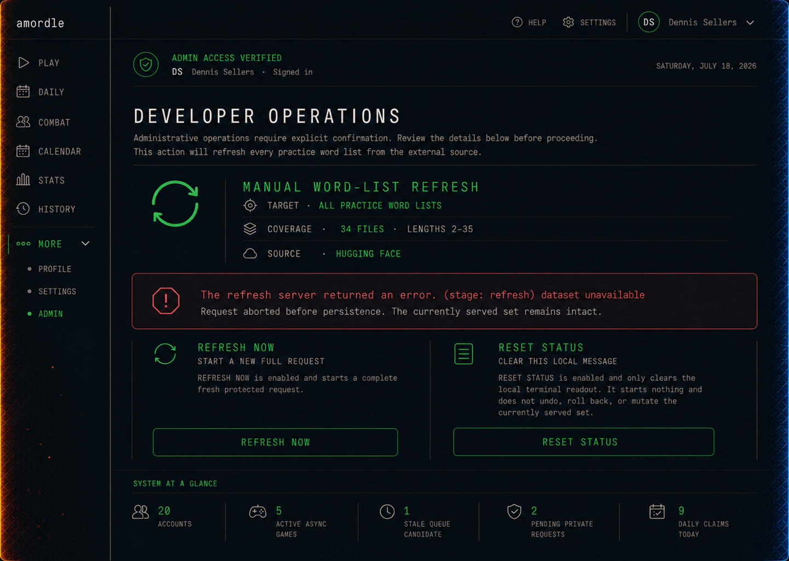](concepts/locked/L55.png)

[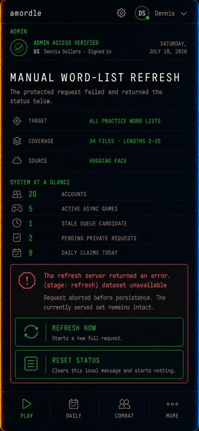](concepts/locked/L56.png)

Recovery Brief and Quiet Recovery Dock form the locked desktop/mobile terminal-failure pair for a verified Admin after one full 34-file, lengths-2-through-35 Hugging Face request returns the source-tested refresh-stage server error. Both make the exact failure and served-set-intact guarantee immediately readable, then separate enabled full-request Refresh now from enabled local-only Reset status without implying partial retry, rollback, or service-console access. Quiet Recovery Dock preserves the established compact mobile Admin continuation family.

Binding notes: replace stale pre-confirmation copy with truthful terminal-failure context; preserve the exact source failure as one accessible status; keep helper copy concise and nonduplicative; replace shield-like verified-access and pending-private-request icons with neutral check-circle/lock and request/inbox treatments; keep both controls ordinarily enabled; derive page and aggregate values at runtime; keep the mobile recovery dock in normal document flow, nonsticky, nonmodal, and nondraggable; preserve readable type, full accessible targets, natural scrolling, and bottom-navigation clearance; correct the mobile active-navigation state so More is active and Play is neutral; and never add success/persistence reporting, progress, raw per-length failures, narrow retries, raw payloads, storage metadata, rollback, deployment, publication, or service-console behavior.

Grounding and round records remain linked from the resolved desktop and mobile selection gates.

### L57–L58 — Protected Admin, anonymous access denied

[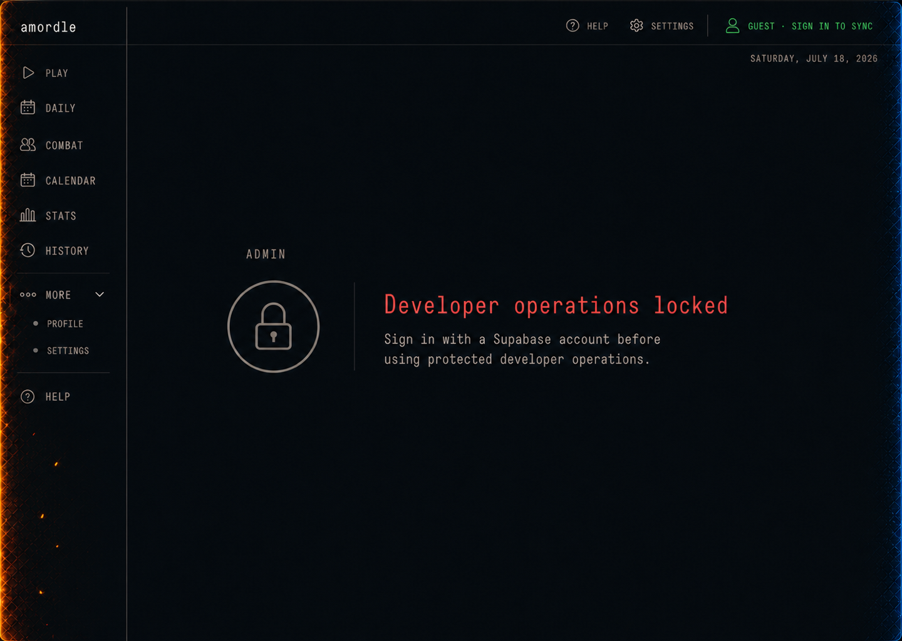](concepts/locked/L57.png)

[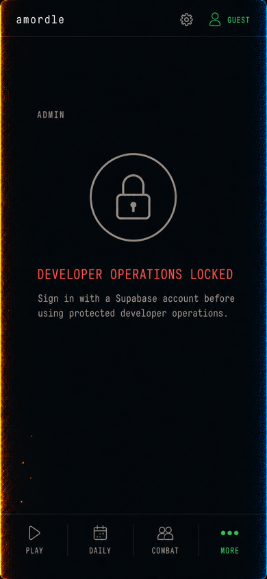](concepts/locked/L58.png)

Guest Threshold and Guest Lock Stack are the locked desktop/mobile missing-authentication pair for an anonymous user who reaches protected Admin through direct or persisted navigation. They extend Lock Marker's quiet access language while keeping the enabled global Guest sign-in control structurally separate from one exact actionless denial and leaving ordinary non-Admin routes available. The mobile stack keeps More as the active destination family, preserves natural document flow, and clears fixed bottom navigation.

Binding notes: preserve the global Guest control as the only authentication action; keep Admin absent from primary navigation; keep the exact source title/message as one accessible alert with no embedded action; preserve readable type, natural mobile scrolling, accessible targets, bottom-navigation clearance, and the intentionally quiet remainder of the route; derive any displayed date from runtime state; and never add a privileged preview, dashboard, aggregate, refresh control, endpoint, role detail, credential, configuration detail, or disabled Admin item.

Grounding and round records remain linked from the resolved desktop and mobile selection gates.

### L59–L60 — Protected Admin, unconfigured environment

[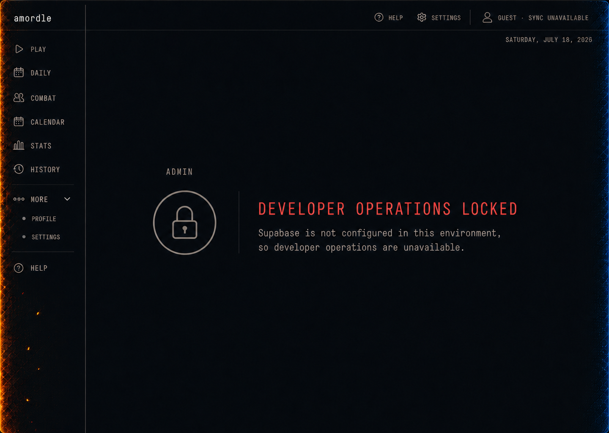](concepts/locked/L59.png)

[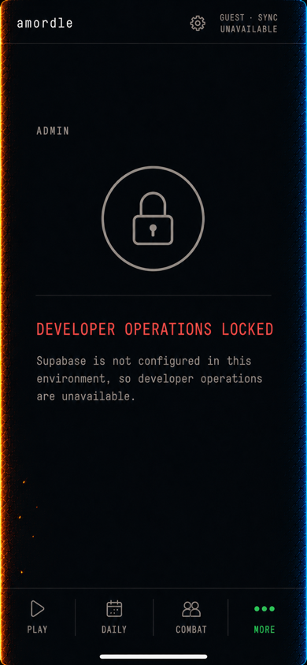](concepts/locked/L60.png)

Syncless Threshold and Syncless Lock Stack are the locked desktop/mobile configuration-unavailable pair for protected Admin reached through direct or persisted navigation. They extend Guest Threshold, Guest Lock Stack, and Lock Marker while changing the global account contract to muted, noninteractive `GUEST · SYNC UNAVAILABLE`: authentication itself is unavailable, the exact denial is actionless, ordinary non-Admin routes remain usable, and no setup or privileged detail appears. Syncless Lock Stack is the literal mobile continuation, retaining readable type, natural flow, and fixed-navigation/safe-area clearance.

Binding notes: implement the global account state as genuinely noninteractive with no hover, press, focus, menu, chevron, or sign-in affordance; keep Admin absent from primary navigation; preserve the exact source title/message as one accessible alert with no embedded action; keep the lock neutral and the remainder intentionally quiet; derive any displayed date from runtime state; distinguish missing configuration from anonymous access and network outage; allow mobile title/message wrapping and text scaling in natural document flow; preserve bottom-navigation and safe-area clearance; and never add setup instructions, a sign-in/configure/retry path, privileged preview, dashboard, aggregate, refresh control, endpoint, role detail, credential, service metadata, or disabled Admin item.

Grounding and round records remain linked from the resolved desktop and mobile selection gates.

### L61–L62 — Protected Admin, authorized Operational Dashboard ready

[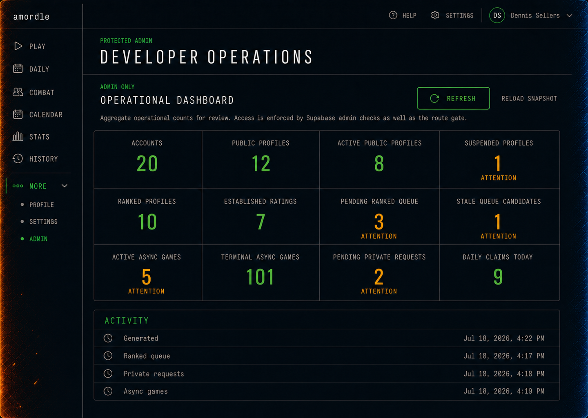](concepts/locked/L61.png)

[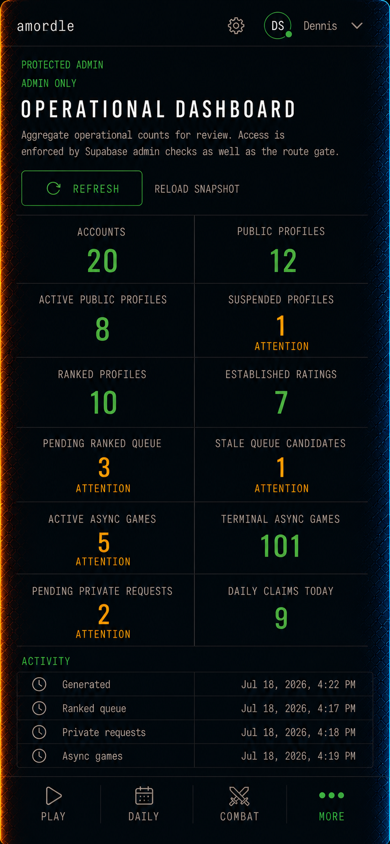](concepts/locked/L62.png)

Operations Matrix and Matrix Stack form the locked desktop/mobile ready-state dashboard pair for a verified Admin. They express the implementation's exact twelve approved aggregate metrics as one ruled source-order collection, follow them with four approved activity timestamps, identify the five source-defined attention signals without turning them into alarms, and retain exactly one aggregate-snapshot Refresh action. Matrix Stack is the literal naturally scrolling mobile continuation rather than a generic stack of cards.

Binding notes: implement both matrices as one accessible semantic source-order collection; preserve full label wrapping, ordinary readable type, accessible targets, natural mobile scrolling, and fixed-navigation/safe-area clearance; replace Matrix Stack's generated crossed-weapons COMBAT icon with a neutral group icon or plain label; restore `DEVELOPER OPERATIONS` visibly or accessibly in the mobile hierarchy; keep written amber attention descriptive and non-alarmist; derive all values and timestamps from runtime state; keep exactly one dashboard-snapshot Refresh distinct from manual word-list refresh; and preserve the full authority, privacy, keyboard, focus, reduced-motion, and no-invention rules in the resolved desktop and mobile gates.

### L63–L64 — Cross-system state sheets

[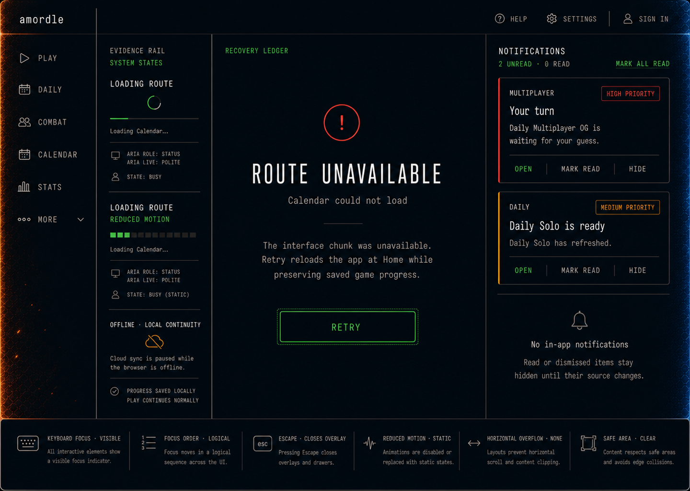](concepts/locked/L63.png)

[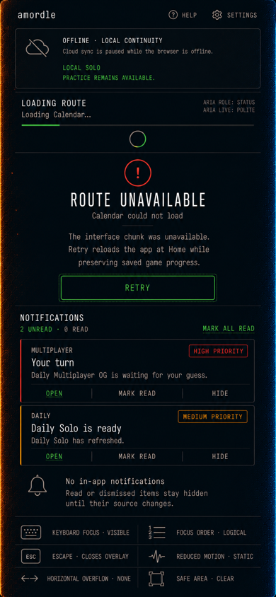](concepts/locked/L64.png)

Recovery Ledger and Continuity Dock form the locked desktop/mobile internal reference pair for cross-system loading, route recovery, offline continuity, in-app notifications, keyboard focus, logical focus order, Escape behavior, reduced motion, horizontal-overflow protection, and safe-area clearance. Recovery Ledger keeps route recovery primary while separating desktop evidence rails. Continuity Dock converts that hierarchy into one naturally scrolling mobile continuity spine with an in-flow notification register and compact behavior contract. Neither is a user-facing product route.

Binding notes: preserve exact source-backed copy and exactly one Retry; replace the desktop `PLAY CONTINUES NORMALLY` and mobile split availability treatment with exact `LOCAL SOLO / PRACTICE REMAINS AVAILABLE`; visible ARIA labels are internal contract annotations rather than product copy; populated and empty notification states are mutually exclusive in production; add a distinct static loading equivalent to Continuity Dock; label its empty notification specimen as an alternate production state; remove its Help/Settings header unless used only as noninteractive safe-area evidence; keep the mobile behavior dock in ordinary document flow—nonsticky, nonmodal, and nondraggable; preserve ordinary readable type, natural scrolling, text-backed state meaning, and every no-invention/privacy rule in the resolved desktop and mobile gates.

The gallery completion gate records all 64 planned P01–P13 locks and closes further planned concept-image generation.

## Completed concept packages

The table below records the completed P01–P13 coverage. It is implementation context, not authorization to invent routes or behavior.

| Order | Package | Planned desktop/mobile coverage | Status |
|---:|---|---|---|
| P01 | Stats and Leaderboard | Private local/synced Solo statistics, separate multiplayer performance, public ranked tables, rating metadata, freshness, filters, and approved public-profile entry points. This package extends the locked History/result language without requiring a new gameplay model. | Locked |
| P02 | Profile and account | Self profile, display-only public profile, guest/authenticated differences, sign-in/reset entry, Player name/card details, privacy, request/blocking preferences, safe sync/guest transfer, and destructive-account confirmation boundaries. | Locked |
| P03 | Marketplace and progression | XP, level, coins, coin-funded Solo Practice consumables, inventory, purchase/insufficient-balance states, and notifications without implying real-money commerce. | Locked |
| P04 | Word Explorer and Definitions | Search/browse of the exact game lexicon, word detail, definition results, post-game definition handoff, and share-result affordances without exposing active answers. | Locked |
| P05 | Settings and preferences | Accent/surface themes, sound, reduced motion, notifications, difficulty/GO/Hard Mode defaults, account access, sync/local-progress controls, and privacy settings. | Locked |
| P06 | Help, tutorial, Feedback, and About | First-run/skippable onboarding, replayable Help tutorial, rules/route guide, bug/feature feedback entry, project notes, credits, and release information. | Locked |
| P07 | Home command hub | Guest-first Home, active/resumable Solo and COMBAT summaries, today's play, Lobby/Live/History entry, route attention, and account/progression context. Home is deliberately later so it summarizes accepted destination patterns rather than inventing premature dashboard content. | Locked |
| P08 | COMBAT Live spectator | Practice-only public Live browsing and read-only match view, shared visible move evidence, turn/status context, restricted/private states, no Daily spectator access, and safe exit/navigation on desktop and mobile. | Locked |
| P09 | Solo active gameplay states | Solo Daily/Practice OG and GO, regular and focused play, GO chain progress/transition, Practice customization and variable word lengths, Hard Mode, consumables where allowed, resume/re-entry, validation, and responsive board/keyboard behavior using the locked shell language. | Locked |
| P10 | Solo post-game and result handoff | OG/GO win/loss, reveal/give-up where allowed, solved-row hold, rewards, definitions, sharing, replay/new-game routes, Daily re-entry, and History/Calendar handoff without crowding active play. | Locked |
| P11 | COMBAT gameplay validation pack | GO chain play, Daily asynchronous state, ranked/unranked context, 3-letter and 8-letter Practice stress cases, long-guess continuation, timeout/forfeit/cancel states, and score/turn projection using the locked gameplay shell rather than a new visual identity. | Locked |
| P12 | Protected Admin | Permission-denied and authorized refresh-control states, target/state clarity, safe confirmation, aggregate operational review, and result reporting without exposing secrets or service metadata to unauthorized users. | Locked |
| P13 | Cross-system and responsive state sheets | Loading, empty, error, offline/PWA, lazy-route retry, notifications, focus/keyboard navigation, reduced motion, safe-area behavior, mobile overflow, and recovery states. These are collected into a final desktop/mobile internal state-sheet pair rather than invented as a user-facing route. | Locked |

## Completion status

- **Required core gallery:** all 62 planned P01–P12 desktop/mobile locks are complete.
- **P13 decision:** dedicated state sheets are warranted because the remaining language spans every accepted route and should be visually bound before implementation.
- **P13 desktop:** Recovery Ledger is locked as L63.
- **P13 mobile:** Continuity Dock is locked as L64.
- **Complete gallery:** all 64 planned P01–P13 desktop/mobile locks are complete.
- **Remaining planned concept-image rounds:** zero.
- **Audit result:** the cross-gallery consistency audit closed with no Blocking issue and no material gap requiring a corrective concept round.
- **Derived authority:** the final visual contract, stack reassessment, and readiness assessment are complete.
- **Acceptance:** Ryan explicitly accepted the audit, visual contract, stack reassessment, and readiness assessment on 2026-07-18.
- **Next:** the fresh Plan-mode task must produce one end-to-end greenfield implementation plan with an early interactive fidelity proof and recurring comparisons against these exact images.

## Route-to-concept coverage

This table maps the accepted route inventory so no destination silently disappears during the greenfield implementation.

| Current route or contract | Locked/planned coverage |
|---|---|
| `home` | P07 Home command hub |
| `solo` | L07–L08 overview; P09 active play; P10 result handoff |
| `calendar`, hidden `og-daily`, hidden `go-daily` | L09–L10 Calendar; P09–P10 gameplay/result states |
| hidden `practice` compatibility route | L07–L08 Solo and L03–L04 COMBAT entry; P09/P11 gameplay validation |
| `multiplayer` | L01–L06 active play/hub/result; P08 Live spectator; P11 broader gameplay states |
| `marketplace` | P03 Marketplace and progression |
| `history` | L11–L12 History |
| `leaderboard`, `stats` | P01 Stats and Leaderboard |
| `word-explorer`, `definitions` | P04 Word Explorer and Definitions |
| `profile`, hidden `public-profile` | P02 Profile and account |
| `settings` | P05 Settings and preferences |
| `help`, `feedback`, `about` | P06 Help/tutorial/Feedback/About |
| `admin` | P12 protected Admin |
| Global loading, offline, notification, accessibility, and recovery contracts | P13 cross-system state sheets |

## Shared visual contract

The implementation inherits these accepted visual principles:

- lowercase `amordle`; mature, competitive, technical, and restrained rather than childlike or decorative;
- graphite/near-black fields, condensed readable typography, fine rules, restrained green interaction/status emphasis, and balanced ember-left/frost-right atmospheric framing;
- factual text and shape in addition to color; green correct/won, amber present/draw, gray absent/unknown, and red only for clearly negative/destructive/live-alert semantics as resolved by each gate;
- neutral route and status iconography; no weapons, shields, trophies as generic confirmation marks, characters, franchise logos, dragons, gore, or borrowed intellectual property;
- persistent desktop and mobile navigation with a credible overflow strategy, visible account/settings context, accessible targets, natural scrolling, no horizontal overflow, safe-area clearance, focus visibility, and reduced-motion support;
- production data and behavior come from the implementation and preservation contracts, never from generated-art invention.

## Implementation maintenance rule

During implementation:

1. map each coherent screen/state to its relevant locked desktop and mobile concepts before coding;
2. capture real deterministic desktop/mobile evidence at early and recurring milestones;
3. compare composition, hierarchy, density, typography, atmosphere, spacing, and responsive adaptation directly;
4. apply every binding correction rather than copying generated mistakes or fixture claims;
5. keep runtime behavior and data grounded in the contracts;
6. treat a material visual-direction change as a Ryan decision rather than silently updating this authority;
7. keep implementation evidence ignored and exclude this private bootstrap material from any later public application history.

## Current gate

All 64 P01–P13 desktop/mobile concepts are locked. The next task is planning-only: design the complete greenfield application and its implementation/preview/test/checkpoint strategy. This map does not authorize production source changes, package installation, service use, deployment, Git writes, publication, or another concept round.
